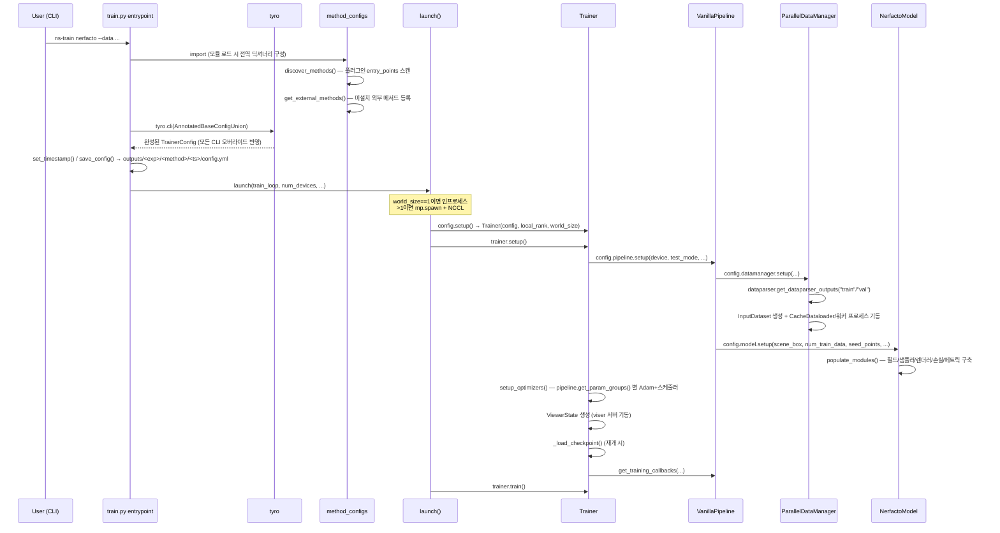
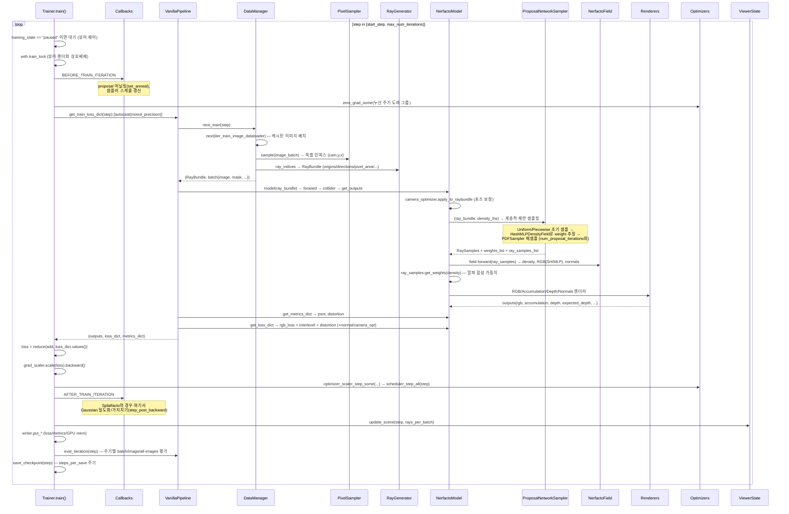
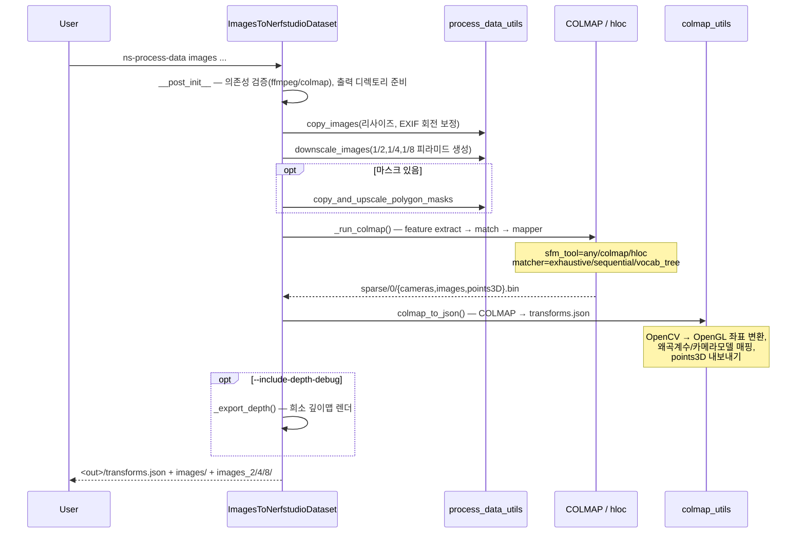
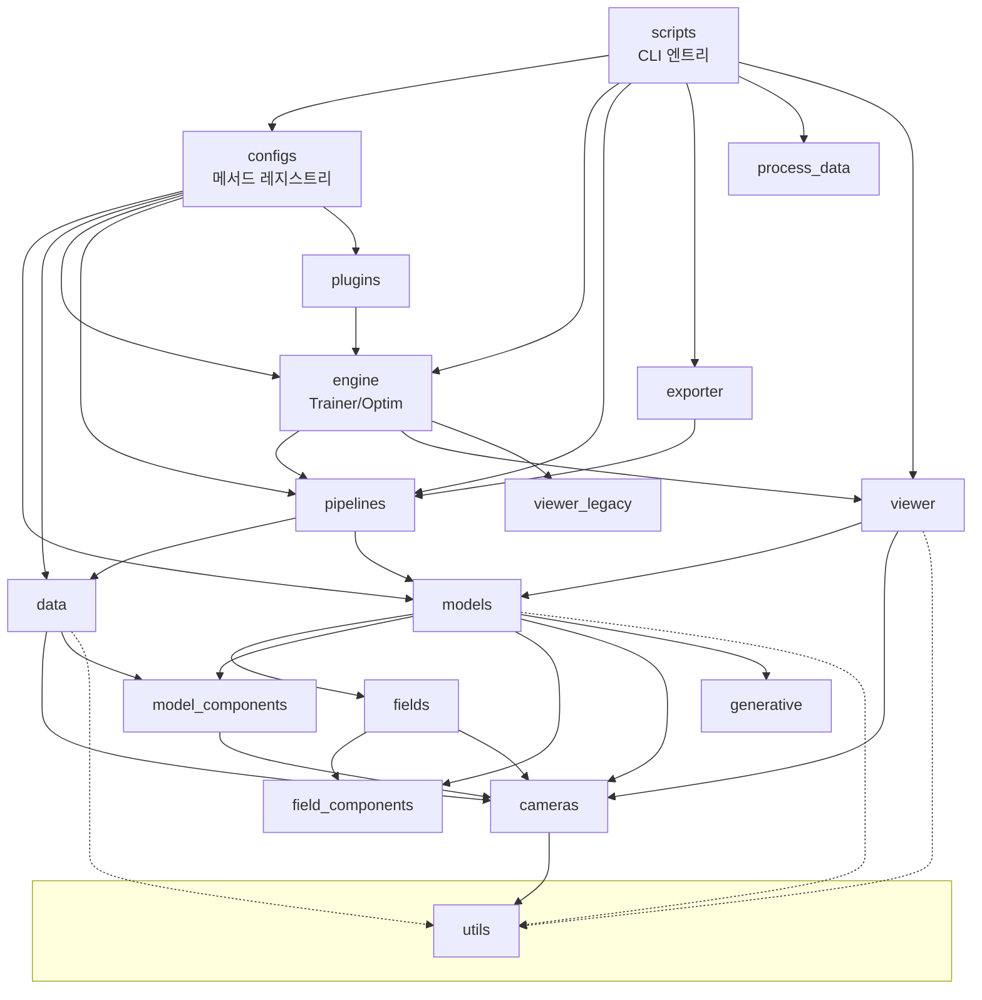

# nerfstudio 전체 분석

> 버전 `1.1.5` · Apache-2.0 · 소스 50,731 LOC / 231 `.py` 파일 (테스트 2,860 LOC 포함)

---

## Phase 1: 프로젝트 개요

### 프로젝트 목적

nerfstudio는 **NeRF(Neural Radiance Fields) 및 3D Gaussian Splatting 기반 3D 재구성 방법론을 위한 통합 프레임워크**다. 사진/영상에서 카메라 포즈를 추정하고(`ns-process-data`), 방사휘도장을 학습하고(`ns-train`), 실시간 브라우저 뷰어로 확인하고(`ns-viewer`), 메시/포인트클라우드/`.ply`로 내보내는(`ns-export`) 전 과정을 하나의 CLI 도구 모음으로 제공한다.

핵심 설계 목표는 **모듈성**이다. 논문마다 처음부터 다시 구현하는 대신, 데이터 파서 / 샘플러 / 필드 / 인코딩 / 렌더러 / 손실 함수를 교체 가능한 컴포넌트로 분해하여 새 방법론을 조합으로 만들 수 있게 한다. 실제로 `nerfacto`는 Mip-NeRF 360의 scene contraction + Instant-NGP의 해시 인코딩 + proposal network 샘플링 + 포즈 최적화를 조합한 "레시피"에 가깝다.

### 기술 스택

| 계층 | 기술 |
|---|---|
| 언어 | Python ≥3.8, 전체 `from __future__ import annotations` |
| 딥러닝 | PyTorch ≥1.13, `torchmetrics[image]` (PSNR/SSIM/LPIPS) |
| CUDA 가속 | `tiny-cuda-nn`(선택, 해시 인코딩/융합 MLP), `nerfacc==0.5.2`(볼륨 샘플링), `gsplat==1.4.0`(Gaussian 래스터화) |
| CLI / 설정 | `tyro` (dataclass → CLI 자동 생성; **이 프로젝트의 아키텍처 중추**) |
| 타입 | `jaxtyping` (런타임 텐서 shape 검증), `pyright` |
| 뷰어 | `viser==1.0.0` (WebSocket 기반 3D 뷰어), 레거시 React 앱 |
| 데이터 | COLMAP / hloc / Metashape / RealityCapture / Polycam / Record3D / ODM / ARKit / nuScenes / ScanNet(++) / Dycheck |
| 로깅 | tensorboard, wandb, comet_ml, `rich` 콘솔 |
| 지오메트리 | open3d, pymeshlab, trimesh, xatlas, `splines` |
| 품질 | ruff 0.12.2 (line-length 120), pytest + xdist, pre-commit |

### 디렉토리 구조

```
nerfstudio/
├── cameras/          2,762 LOC  카메라 모델, 광선 생성, 포즈 최적화, 카메라 경로
├── configs/          1,602 LOC  설정 dataclass 계층 + 메서드 레지스트리
├── data/             8,542 LOC  ★최대. 데이터 파서 / 데이터셋 / 데이터매니저 / 픽셀 샘플러
│   ├── dataparsers/            16종 포맷 → DataparserOutputs 정규화
│   ├── datasets/               InputDataset 및 depth/sdf/semantic 변형
│   ├── datamanagers/           학습 루프에 배치를 공급 (vanilla/parallel/full-image/random-camera)
│   └── utils/                  데이터로더, COLMAP 파싱, 데이터 유틸
├── engine/           1,080 LOC  Trainer, Optimizers, Schedulers, Callbacks
├── exporter/         1,504 LOC  포인트클라우드/TSDF/Poisson/마칭큐브/텍스처
├── field_components/ 1,675 LOC  인코딩(Hash/NeRF/Triplane/KPlanes/TensorVM), MLP, 임베딩, 활성화, 공간왜곡
├── fields/           1,713 LOC  필드 = 인코딩+MLP 조합 (nerfacto/sdf/tensorf/vanilla/nerfw/generfacto)
├── generative/         712 LOC  Stable Diffusion / DeepFloyd 텍스트→NeRF 가이던스
├── model_components/ 2,706 LOC  광선 샘플러, 렌더러, 손실, 콜라이더, 셰이더, bilateral grid
├── models/           4,331 LOC  완성된 방법론 13종 (nerfacto/splatfacto/instant-ngp/neus/tensorf/...)
├── pipelines/          585 LOC  DataManager + Model을 묶는 얇은 조정 계층
├── plugins/            223 LOC  entry_points 기반 외부 메서드/데이터파서 등록
├── process_data/     3,438 LOC  이미지/영상 → COLMAP → transforms.json 전처리
├── scripts/          6,089 LOC  10개 CLI 엔트리포인트 (ns-train, ns-render, ns-export, ...)
├── utils/            3,491 LOC  writer, profiler, tensor_dataclass, colormaps, math, poses
├── viewer/           3,660 LOC  viser 기반 현행 뷰어 (렌더 상태 머신, 컨트롤 패널, 렌더 패널)
└── viewer_legacy/    3,517 LOC  구 뷰어 (deprecated, 여전히 `--vis viewer_legacy`로 접근 가능)
```

### 아키텍처 패턴

1. **Config-as-Code + `_target` 팩토리** — 모든 컴포넌트가 `InstantiateConfig` 하위 dataclass를 갖고, `_target` 필드가 인스턴스화할 클래스를 가리킨다. `config.setup(**kwargs)` → `self._target(self, **kwargs)`. 설정 트리 전체가 실행 그래프의 선언적 표현이 된다. ([base_config.py:46-53](nerfstudio/configs/base_config.py#L46-L53))

2. **`tyro` 기반 서브커맨드 CLI** — `method_configs` 딕셔너리(메서드명 → 완성된 `TrainerConfig`)가 `tyro.extras.subcommand_type_from_defaults`로 CLI Union 타입이 된다. 즉 **CLI 파서를 따로 쓰지 않는다.** dataclass 필드가 곧 `--pipeline.model.hidden-dim` 같은 플래그다.

3. **템플릿 메서드 패턴** — `Model`, `DataParser`, `DataManager`가 추상 훅(`populate_modules`, `get_outputs`, `get_loss_dict`, `_generate_dataparser_outputs`, `next_train`)을 정의하고 하위 클래스가 채운다.

4. **`TensorDataclass`** — `Cameras`, `RayBundle`, `RaySamples`, `Frustums`가 상속. dataclass 필드 전체에 대해 브로드캐스팅, 인덱싱, `.to(device)`, `reshape`을 자동 지원한다. NumPy 배열처럼 다룰 수 있는 구조체 배열. ([tensor_dataclass.py](nerfstudio/utils/tensor_dataclass.py))

5. **콜백/훅 시스템** — 모델이 `TrainingCallback`을 등록하면 Trainer가 `BEFORE_TRAIN_ITERATION` / `AFTER_TRAIN_ITERATION` / `AFTER_TRAIN` 시점에 호출. proposal network 어닐링, Gaussian 밀도화 같은 스텝 의존 로직을 학습 루프 수정 없이 주입한다.

6. **플러그인 아키텍처** — `nerfstudio.method_configs` / `nerfstudio.dataparser_configs` entry point group. 외부 패키지가 `pip install`만으로 `ns-train <새메서드>`에 등장한다. 환경변수 `NERFSTUDIO_METHOD_CONFIGS`로도 주입 가능.

7. **전역 싱글턴 사이드채널** — `utils/writer.py`(로깅)와 `utils/profiler.py`(프로파일링)는 모듈 레벨 전역 상태 + 데코레이터로 어디서든 접근 가능하게 만든다. 의존성 주입을 우회하는 실용적 선택.

---

## Phase 2: 진입점 및 실행 흐름

### 엔트리포인트 (pyproject `[project.scripts]`)

| 명령 | 모듈 | 역할 |
|---|---|---|
| `ns-train` | [scripts/train.py](nerfstudio/scripts/train.py) | 학습 (주 진입점) |
| `ns-process-data` | [scripts/process_data.py](nerfstudio/scripts/process_data.py) | 이미지/영상 → nerfstudio 데이터셋 |
| `ns-download-data` | [scripts/downloads/download_data.py](nerfstudio/scripts/downloads/download_data.py) | 공개 데이터셋 다운로드 |
| `ns-viewer` | [scripts/viewer/run_viewer.py](nerfstudio/scripts/viewer/run_viewer.py) | 체크포인트를 뷰어로 열기 |
| `ns-eval` | [scripts/eval.py](nerfstudio/scripts/eval.py) | PSNR/SSIM/LPIPS 계산 |
| `ns-render` | [scripts/render.py](nerfstudio/scripts/render.py) | 카메라 경로 영상 렌더 |
| `ns-export` | [scripts/exporter.py](nerfstudio/scripts/exporter.py) | 메시/포인트클라우드/GS ply |
| `ns-install-cli` | scripts/completions/install.py | 셸 자동완성 설치 |
| `ns-dev-test` | scripts/github/run_actions.py | CI 액션 로컬 실행 |
| `ns-dev-sync-viser-message-defs` | scripts/viewer/sync_viser_message_defs.py | 레거시 뷰어 메시지 정의 동기화 |

### 유스케이스 1 — `ns-train nerfacto --data <path>` (학습)

부트스트랩 단계:



학습 루프 1 스텝:



### 유스케이스 2 — `ns-process-data images --data <dir> --output-dir <out>`



### 유스케이스 3 — 뷰어 실시간 렌더 (학습과 동시)

```mermaid
sequenceDiagram
    participant B as Browser (viser client)
    participant VS as viser Server
    participant V as Viewer
    participant RSM as RenderStateMachine (thread/client)
    participant TR as Trainer loop
    participant M as Model

    B->>VS: WebSocket 연결
    VS->>V: handle_new_client → RenderStateMachine.start()
    B->>VS: 카메라 이동 이벤트
    VS->>V: camera update 콜백
    V->>RSM: action(RenderAction("move", camera_state))
    Note over RSM: 상태 전이 low_move → low_static → high<br/>(움직임 중 저해상도, 정지 시 고해상도)
    RSM->>RSM: _calculate_image_res(aspect) — train_util 비율로 해상도 결정
    RSM->>TR: train_lock 획득 (학습 스텝과 상호배제)
    RSM->>M: model.eval(); get_outputs_for_camera(camera, obb_box)
    Note over M: SetTrace(check_interrupt)로<br/>새 카메라 입력 시 렌더 중단 가능
    M-->>RSM: outputs{rgb, depth, accumulation, ...}
    RSM->>RSM: train_lock 해제; model.train() 복원
    RSM->>RSM: 컬러맵 적용 / split view 합성 / gl_z_buf_depth 계산
    RSM->>VS: set_background_image(JPEG/PNG, depth)
    VS->>B: 프레임 전송
    TR->>V: 매 스텝 update_scene(step) → _trigger_rerender
```

---

## Phase 3: 핵심 모듈 심층 분석

### 3.1 `engine/trainer.py` — 학습 오케스트레이터 (566 LOC)

- **책임**: 파이프라인·옵티마이저·뷰어·로거·체크포인트를 조립하고 학습 루프를 구동한다.
- **주요 export**: `TrainerConfig`(steps_per_save, max_num_iterations, mixed_precision, load_dir/load_step/load_config/load_checkpoint, gradient_accumulation_steps, start_paused), `Trainer`.
- **의존**: `pipelines.base_pipeline`, `engine.{callbacks,optimizers}`, `viewer.viewer`, `viewer_legacy.server.viewer_state`, `utils.{profiler,writer,decorators,misc}`.
- **핵심 알고리즘 — `train_iteration`** ([trainer.py:487](nerfstudio/engine/trainer.py#L487)):
  1. `gradient_accumulation_steps[group]` 주기가 도래한 파라미터 그룹만 `zero_grad`
  2. `torch.autocast`(mixed precision) 안에서 `pipeline.get_train_loss_dict(step)`
  3. `loss = functools.reduce(torch.add, loss_dict.values())` — **손실 딕셔너리 값의 단순 합**. 가중치는 각 모델의 `get_loss_dict` 안에서 이미 곱해져 있다.
  4. `grad_scaler.scale(loss).backward()`
  5. 누산 주기 끝에 도달한 그룹만 `optimizer_scaler_step_some`
  6. **grad scaler가 스케일을 낮췄으면(=스텝이 스킵됐으면) 스케줄러를 진행시키지 않는다** — 미묘하지만 중요한 정확성 디테일
- **주목할 상태**: `training_state ∈ {training, paused, completed}`를 뷰어가 직접 토글한다. `train_lock: Lock`이 학습 스텝과 뷰어 렌더의 상호배제를 보장.

### 3.2 `pipelines/base_pipeline.py` — 데이터↔모델 접합부 (585 LOC 중 핵심)

- **책임**: DataManager와 Model 사이의 얇은 조정 계층. DDP 래핑 지점이기도 하다.
- **주요 export**: `Pipeline`(추상), `VanillaPipelineConfig`, `VanillaPipeline`, `module_wrapper`.
- **핵심 흐름** ([base_pipeline.py:290](nerfstudio/pipelines/base_pipeline.py#L290)):
  ```python
  ray_bundle, batch = self.datamanager.next_train(step)
  model_outputs = self._model(ray_bundle)   # DDP면 래퍼 통과
  metrics_dict = self.model.get_metrics_dict(model_outputs, batch)
  loss_dict = self.model.get_loss_dict(model_outputs, batch, metrics_dict)
  ```
  `self._model`(DDP 래퍼일 수 있음)로 forward, `self.model`(항상 실제 모듈)로 메서드 호출 — 이 구분이 `module_wrapper` / `model` 프로퍼티의 존재 이유다.
- **주목**: `__init__`에서 `train_dataparser_outputs.metadata["points3D_xyz"]`를 꺼내 `seed_points`로 모델에 넘긴다. Splatfacto의 Gaussian 초기화 경로이며, 소스에도 `# TODO make cleaner`가 달려 있는 특수 케이스 배선이다.
- `load_state_dict`가 `_model.` 접두사를 붙였다 뗐다 하며 DDP/non-DDP 체크포인트 호환을 처리한다.

### 3.3 `data/` — 데이터 계층 (8,542 LOC, 최대 패키지)

4단 파이프라인: **DataParser → Dataset → DataManager → (PixelSampler + RayGenerator)**

**DataParser** ([base_dataparser.py](nerfstudio/data/dataparsers/base_dataparser.py)) — 16종 포맷을 `DataparserOutputs`로 정규화:
```python
@dataclass
class DataparserOutputs:
    image_filenames: List[Path]
    cameras: Cameras
    alpha_color: Optional[Float[Tensor, "3"]]
    scene_box: SceneBox                     # AABB
    mask_filenames: Optional[List[Path]]
    metadata: Dict[str, Any]                # depth_filenames, points3D_xyz, semantics 등 확장 슬롯
    dataparser_transform: Float[Tensor, "3 4"]  # 원본 좌표계 복원용
    dataparser_scale: float
```
`dataparser_transform`/`dataparser_scale`은 학습 시작 시 `dataparser_transforms.json`으로 저장되어, 나중에 렌더/내보내기 결과를 **원본 세계 좌표계로 되돌릴 수 있게** 한다 (`transform_poses_to_original_space`).

**DataManager** — 3가지 전략이 공존:
| 구현 | 반환 단위 | 용도 |
|---|---|---|
| `VanillaDataManager` | `RayBundle` | 기본 광선 기반 NeRF |
| `ParallelDataManager` | `RayBundle` | 워커 프로세스가 광선 배치를 미리 생성 (nerfacto 기본) |
| `FullImageDatamanager` | `Cameras` | 전체 이미지 단위 — Splatfacto 등 래스터화 모델 |
| `RandomCamerasDataManager` | `Cameras` | Generfacto(텍스트→NeRF) — 데이터셋 없이 카메라 샘플링 |

이 이질성이 `Union[RayBundle, Cameras]` 타입을 코드베이스 전반에 퍼뜨린다 (Phase 7 참조).

**PixelSampler** ([pixel_samplers.py](nerfstudio/data/pixel_samplers.py), 590 LOC) — 캐시된 이미지 배치에서 `(camera_idx, y, x)` 인덱스를 뽑는다. `PatchPixelSampler`(패치 단위), 등장방형 카메라용 위도 가중 샘플링, fisheye crop radius 마스킹, 마스크 인지 샘플링, 가변 해상도 배치 지원.

**CacheDataloader** ([data/utils/dataloaders.py](nerfstudio/data/utils/dataloaders.py), 755 LOC) — N장을 메모리에 캐시하고 M회 재사용 후 교체. 디스크 I/O를 학습 루프에서 분리하는 핵심 최적화.

### 3.4 `models/` — 방법론 구현 (4,331 LOC)

`Model` 기반 클래스 ([base_model.py](nerfstudio/models/base_model.py))가 정의하는 계약:

| 훅 | 역할 |
|---|---|
| `populate_modules()` | 필드/샘플러/렌더러/손실/메트릭 구축 (`__init__` 말미 호출) |
| `get_param_groups()` | `{"fields": [...], "proposal_networks": [...]}` — 옵티마이저 그룹 |
| `get_outputs(ray_bundle_or_cameras)` | 순전파. `Dict[str, Tensor]` 반환 |
| `get_metrics_dict(outputs, batch)` | 손실에 쓰이는 값 포함 (예: distortion) |
| `get_loss_dict(outputs, batch, metrics_dict)` | **가중치가 이미 곱해진** 손실 항들 |
| `get_outputs_for_camera(camera, obb_box)` | 평가/뷰어용 전체 이미지 렌더 |
| `get_training_callbacks(attrs)` | 스텝 의존 로직 등록 |
| `get_image_metrics_and_images(...)` | PSNR/SSIM/LPIPS + 시각화 이미지 |

**`NerfactoModel`** — 대표 레시피 ([nerfacto.py](nerfstudio/models/nerfacto.py)):
- `SceneContraction(order=inf)` — 무한 장면을 유한 부피로 매핑 (Mip-NeRF 360)
- `NerfactoField` — 해시 그리드 인코딩 + 융합 MLP + appearance embedding
- `HashMLPDensityField` × N (proposal networks) — 경량 밀도 전용 필드
- `ProposalNetworkSampler` — 계층적 재샘플링. `set_anneal(step)` 콜백이 초반 학습에서 PDF를 부드럽게 만든다:
  ```python
  train_frac = np.clip(step / N, 0, 1)
  bias = lambda x, b: b*x / ((b-1)*x + 1)
  anneal = bias(train_frac, proposal_weights_anneal_slope) ** ...
  ```
- 손실: `rgb_loss` + `interlevel_loss`(proposal↔최종 분포 정합) + `distortion_loss`(부유물 억제) + 선택적 normal/camera-opt 정규화
- `CameraOptimizer(mode="SO3xR3")` — 카메라 포즈를 학습 가능 파라미터로 보정

**`SplatfactoModel`** — Gaussian Splatting ([splatfacto.py](nerfstudio/models/splatfacto.py), 772 LOC, 최대 모델):
- 파라미터는 `nn.ParameterDict` `gauss_params = {means, scales, quats, features_dc, features_rest, opacities}` — 개수가 학습 중 **변하는** 파라미터. 그래서 `load_state_dict`가 체크포인트 크기에 맞춰 파라미터를 재할당한다.
- 초기화: COLMAP `points3D` 시드 → k-NN 평균 거리로 초기 스케일, RGB→SH 계수 변환
- 렌더: `gsplat.rasterization(...)` 직접 호출 — NeRF 경로(샘플러/필드/렌더러)를 **전부 우회**한다
- 밀도 제어: `gsplat`의 `DefaultStrategy`(분할/복제/가지치기/불투명도 리셋) 또는 `MCMCStrategy`(고정 개수 상한). `step_pre_backward` / `step_post_backward` 콜백으로 학습 루프에 삽입
- SH 차수를 `step // sh_degree_interval`로 점진 증가 — coarse-to-fine 색상 학습
- 선택적 `BilateralGrid` — 이미지별 색상/노출 보정

### 3.5 `field_components/encodings.py` — 위치 인코딩 (799 LOC)

| 인코딩 | 논문/용도 |
|---|---|
| `NeRFEncoding` | 원본 sinusoidal, IPE(적분 위치 인코딩) 지원 |
| `HashEncoding` | Instant-NGP 멀티해상도 해시 그리드. tcnn 또는 순수 torch 구현 선택 |
| `RFFEncoding` / `PolyhedronFFEncoding` | 랜덤/다면체 푸리에 피처 |
| `TensorCPEncoding` / `TensorVMEncoding` | TensoRF의 CP/VM 분해 |
| `TriplaneEncoding` | 3평면 분해 |
| `KPlanesEncoding` | 시공간 K-Planes (동적 장면) |
| `SHEncoding` | 구면조화 방향 인코딩 |

`implementation: Literal["tcnn", "torch"]` 스위치가 전 코드베이스에 일관되게 존재 — tiny-cuda-nn이 없어도 동작하되 느린 fallback.

### 3.6 `cameras/cameras.py` — 카메라 모델 (1,054 LOC)

`Cameras(TensorDataclass)`가 지원하는 카메라 타입: `PERSPECTIVE`, `FISHEYE`, `EQUIRECTANGULAR`, `OMNIDIRECTIONALSTEREO_{L,R}`, `VR180_{L,R}`, `ORTHOPHOTO`, `FISHEYE624`.

핵심은 `generate_rays()` → `_generate_rays_from_coords()` (~170 LOC). 픽셀 좌표에서 광선 origin/direction을 만들면서:
- 카메라 타입별 언프로젝션 분기
- 왜곡 계수 역보정 (`camera_utils.radial_and_tangential_undistort`)
- `pixel_area` 계산 — Mip-NeRF의 원뿔 프러스텀 반경 산출에 사용
- ODS/VR180 스테레오는 눈 간격만큼 origin을 오프셋
- `nears`/`fars`, `camera_indices`, `times`(동적 장면), `metadata` 전달

`RayBundle`은 `Frustums`(원뿔대) 표현을 통해 `RaySamples`로 확장되고, `get_weights(densities)`가 알파 합성 가중치를 계산한다.

### 3.7 `viewer/` — 실시간 뷰어 (3,660 LOC)

- **`Viewer`** ([viewer.py](nerfstudio/viewer/viewer.py)) — viser 서버 소유. 클라이언트별 `RenderStateMachine` 스레드 관리, 학습 데이터셋 카메라 프러스텀 시각화, 학습 일시정지/재개 버튼.
- **`RenderStateMachine`** — 상태 `{low_move, low_static, high}` × 액션 `{move, static, step, rerender}`의 전이표. 카메라가 움직이면 저해상도, 멈추면 고해상도로 승격. `sys.settrace` 기반 `check_interrupt`로 렌더 도중 새 입력이 오면 `IOChangeException`을 던져 중단한다 — 영리하지만 침습적인 기법.
- **`ControlPanel`** — 출력 채널 선택, 컬러맵, split view, 크롭 OBB, 배경색, 시간 슬라이더.
- **`render_panel.py`** (1,193 LOC, **저장소 최대 파일**) — 카메라 경로 저작 UI. 키프레임 추가/편집, `splines` 기반 보간, 루프/장력 제어, 재생 미리보기, JSON 내보내기.
- **`viewer_elements.py`** — 모델 코드가 `ViewerSlider`, `ViewerCheckbox`, `ViewerDropdown`을 클래스 속성으로 선언하면 뷰어가 자동으로 GUI에 노출한다. `ViewerControl`은 클릭/포인터 콜백까지 제공.

### 3.8 `plugins/` — 확장 지점 (223 LOC로 가장 작지만 전략적)

```python
# 외부 패키지의 pyproject.toml
[project.entry-points.'nerfstudio.method_configs']
my-method = 'my_pkg:my_method_spec'   # MethodSpecification(config=TrainerConfig(...), description=...)
```
`discover_methods()`가 이를 로드해 `method_configs`에 병합 → `ns-train my-method`가 즉시 동작. 동일 구조의 `registry_dataparser.py`가 데이터파서에 적용된다.

추가로 [configs/external_methods.py](nerfstudio/configs/external_methods.py)는 **설치되지 않은** 외부 메서드 17개(24개 설정)를 더미로 등록한다 — `ns-train lerf`를 치면 "설치 명령은 이것입니다"를 안내한다. 발견 가능성(discoverability)을 위한 훌륭한 UX 패턴.

등록된 외부 메서드: `in2n`, `kplanes`, `lerf`, `livescene`, `feature-splatting`, `tetra-nerf`, `nerfplayer`, `igs2gs`, `pynerf`, `seathru-nerf`, `zipnerf`, `signerf`, `nerfsh`, `nerfgs`, `splatfacto-w` 등.

---

## Phase 4: 모듈 관계도



### ⚠️ 순환 의존 경고

패키지 수준에서 **실제 순환이 여러 개** 존재한다. Python은 모듈 로드 순서로 이를 견디고 있지만, 구조적 부채다.

| 순환 | 경로 | 성격 |
|---|---|---|
| `configs` ↔ `models`/`data`/`engine`/`pipelines` | `configs.method_configs` → 모든 모델/데이터파서 임포트; 모델들은 `configs.base_config.InstantiateConfig` 상속 | **설계상 불가피.** 레지스트리가 모든 구현을 알아야 하고, 구현은 설정 기반 클래스를 알아야 한다. `base_config`와 `method_configs`가 같은 패키지라 순환처럼 보인다. |
| `engine` ↔ `pipelines` | `engine.trainer` → `pipelines.base_pipeline.VanillaPipeline` (구체 타입); `pipelines` → `engine.callbacks/optimizers` | `callbacks.py`는 `TYPE_CHECKING`으로 회피했으나 `trainer.py`는 런타임 임포트. |
| `engine` ↔ `viewer` | `engine.trainer` → `viewer.viewer.Viewer`; `viewer.viewer` → `engine.trainer`(타입) | Trainer가 뷰어를 직접 생성. 뷰어를 옵셔널 플러그인으로 뺄 여지. |
| `cameras` ↔ `data` | `cameras.cameras` → `data.scene_box.{SceneBox,OrientedBox}`; `data.*` → `cameras.Cameras` (39회) | `scene_box`가 `data`가 아니라 기하 유틸(`utils` 또는 `cameras`)에 속하는 게 자연스럽다. |
| `cameras` ↔ `engine` | `cameras.camera_optimizers` → `engine.{optimizers,schedulers}` | 카메라 최적화기가 옵티마이저 설정 타입에 의존. |
| `cameras` → `viewer_legacy` | `cameras.camera_paths` → `viewer_legacy.server.utils.three_js_perspective_camera_focal_length` | **가장 어색한 의존.** 저수준 카메라 모듈이 deprecated 뷰어의 유틸 함수 하나를 위해 UI 계층을 임포트한다. 해당 함수를 `cameras`나 `utils`로 옮기면 즉시 해소된다. |
| `utils` ↔ `configs`/`engine`/`pipelines` | `utils.eval_utils` → `configs.method_configs`, `engine.trainer`, `pipelines`; `utils.{writer,profiler}` → `configs.base_config` | `eval_utils`는 사실상 고수준 스크립트 헬퍼인데 `utils`에 있다. `scripts/` 또는 `engine/`이 적절. |

`TYPE_CHECKING` 가드는 코드베이스 전체에서 **20곳 미만**만 사용된다 (대부분 `viewer_legacy`와 `scripts/downloads`). 순환 위험이 있는 런타임 임포트에 더 널리 적용할 여지가 있다.

---

## Phase 5: 상태 관리 및 데이터 흐름

### 전역 상태

| 위치 | 내용 | 비고 |
|---|---|---|
| `utils/writer.py` | `EVENT_STORAGE`, `EVENT_WRITERS`, `GLOBAL_BUFFER` | 모듈 전역. `put_scalar`/`put_image`/`put_dict`로 어디서든 기록, `write_out_storage()`가 배치 플러시 |
| `utils/profiler.py` | `PROFILER` 리스트 | `@profiler.time_function` 데코레이터가 참조 |
| `utils/comms.py` | `LOCAL_PROCESS_GROUP` | DDP 프로세스 그룹 |
| `configs/method_configs.py` | `method_configs`, `all_methods`, `all_descriptions` | **임포트 시점에 플러그인 스캔이 실행되는 부작용**. 무거운 임포트의 원인 |
| `model_components/renderers.py` | `BACKGROUND_COLOR_OVERRIDE` | 컨텍스트 매니저 `background_color_override_context`로 뷰어가 렌더러 동작을 임시 변경 |
| `Trainer.training_state` | `"training"/"paused"/"completed"` | 뷰어 스레드와 학습 스레드가 공유. `train_lock`으로 보호 |

### 데이터 흐름 방향

**학습은 단방향 파이프라인**이다:
```
디스크 이미지 → DataParser → DataparserOutputs → InputDataset
  → CacheDataloader(캐시/워커) → PixelSampler(인덱스) → RayGenerator
  → RayBundle → Model.get_outputs → outputs dict
  → get_loss_dict → 스칼라 손실 → backward → Optimizers
```

**역방향/이벤트 기반 경로**는 두 갈래:
- **뷰어 → 학습**: 사용자가 일시정지 버튼을 누르면 `Trainer.training_state`가 바뀌고 학습 루프가 `while training_state == "paused": sleep(0.01)`에서 대기. `train_util` 슬라이더가 렌더 해상도를 조절해 학습/렌더 시간 배분을 바꾼다.
- **콜백 → 모델**: `TrainingCallback`이 스텝 함수로 모델 내부 상태를 변경 (proposal 어닐링, Gaussian 분할/가지치기).

### 주요 데이터 변환 지점

1. **좌표계 변환** — COLMAP(OpenCV, y-down/z-forward) → nerfstudio(OpenGL, y-up/z-backward). `process_data/colmap_utils.py`와 각 데이터파서에서 수행.
2. **장면 정규화** — `auto_orient_and_center_poses`(up 벡터 정렬 + 중심 이동) + `scale_factor`로 AABB에 맞춤. `dataparser_transform`/`dataparser_scale`에 기록되어 역변환 가능.
3. **공간 왜곡(contraction)** — `SceneContraction(order=inf)`이 무한 장면을 반지름 2 구로 매핑. 필드 입력 직전 적용.
4. **알파 합성** — `RaySamples.get_weights(densities)`: `alpha = 1-exp(-σδ)`, `T = cumprod(1-alpha)`, `w = alpha*T`. 모든 NeRF 렌더러의 공통 기반.
5. **SH ↔ RGB** — Splatfacto가 `RGB2SH`/`SH2RGB`로 색상을 구면조화 계수로 오간다.

### 외부 연동 패턴

| 종류 | 방식 |
|---|---|
| **서브프로세스** | COLMAP, ffmpeg, hloc — `utils/scripts.py:run_command`로 셸 호출 후 출력 파싱 |
| **CUDA 확장** | tiny-cuda-nn / nerfacc / gsplat — Python 바인딩 직접 호출. `utils/external.py`가 미설치 시 안내 메시지를 띄우는 더미로 대체 |
| **WebSocket** | viser 서버 (기본 7007). 뷰어 브라우저와 양방향 |
| **실험 추적** | wandb / tensorboard / comet — `Writer` 추상 클래스의 3개 구현 |
| **파일 I/O** | `transforms.json`(데이터셋), `config.yml`(pickle된 dataclass를 YAML로), `*.ckpt`(torch.save), `dataparser_transforms.json` |
| **네트워크 다운로드** | gdown / requests / awscli — `ns-download-data` |
| **공유 URL** | pyngrok — `--viewer.make-share-url` |

---

## Phase 6: 설정 및 환경

### 환경 변수

| 변수 | 역할 |
|---|---|
| `NERFSTUDIO_METHOD_CONFIGS` | `name=module:config` 쉼표 구분. entry_point 없이 메서드 주입 (`plugins/registry.py:53`) |
| `NERFSTUDIO_DATAPARSER_CONFIGS` | 동일 형식의 데이터파서 주입 |
| `WANDB_PROJECT` / `WANDB_DIR` / `WANDB_NAME` | wandb 로깅 오버라이드 (`utils/writer.py:312`) |
| `CUDA_LAUNCH_BLOCKING` | 프로파일러가 정확한 시간 측정을 위해 일시적으로 `1`로 설정 후 복원 (`utils/profiler.py:160`) |
| `CONDA_PREFIX` / `HOME` | 셸 자동완성 설치 위치 결정 (`scripts/completions/install.py`) |

**설정의 대부분은 환경변수가 아니라 CLI 플래그와 `config.yml`로 관리된다.** `ExperimentConfig` 트리 전체가 tyro를 통해 노출되므로 `--pipeline.model.<any-field>` 형태로 무엇이든 오버라이드할 수 있다.

### 빌드 설정

- **빌드 백엔드**: setuptools ≥61, `pyproject.toml` 단일 소스
- **패키지 데이터**: `*.cu`, `*.json`, `py.typed`, `setup.bash`, `setup.zsh`
- **추가 의존성 그룹**: `[gen]`(diffusers/transformers/bitsandbytes), `[dev]`(pytest/ruff/pyright/pycolmap/awscli), `[docs]`(sphinx 계열)
- **pixi**: `pixi.toml` + `pixi.lock`(354KB)로 conda 기반 재현 가능 환경 제공
- **Docker**: 루트 `Dockerfile` + `.devcontainer/`. CI가 ghcr.io에 이미지 푸시
- **린트**: ruff `line-length=120`, `select=[E,F,I,PLC,PLE,PLR,PLW,NPY201]`. jaxtyping 때문에 `F722`/`F821` 무시
- **타입 체크**: pyright, `pythonPlatform="Linux"`, `reportMissingImports="warning"`
- **테스트**: `pytest -n=4 --jaxtyping-packages=nerfstudio --disable-warnings` — **런타임 텐서 shape 검증을 켜고 테스트한다**
- **CI**: `core_code_checks.yml`(린트+테스트), `doc.yml`, `publish.yml`, `build_docker_image.yml`
- **pre-commit**: 라이선스 헤더 자동 삽입 → trailing whitespace → ruff + ruff-format

### 로컬 개발 환경 셋업

```bash
# 1) CUDA 툴킷 (11.8 검증됨) 및 NVIDIA GPU 필요
conda create --name nerfstudio -y python=3.8
conda activate nerfstudio
pip install --upgrade pip

# 2) PyTorch + CUDA
pip install torch==2.1.2+cu118 torchvision==0.16.2+cu118 \
  --extra-index-url https://download.pytorch.org/whl/cu118
conda install -c "nvidia/label/cuda-11.8.0" cuda-toolkit

# 3) tiny-cuda-nn (해시 인코딩 가속 — 없으면 torch fallback으로 느리게 동작)
pip install ninja git+https://github.com/NVlabs/tiny-cuda-nn/#subdirectory=bindings/torch

# 4) 개발 설치
pip install --upgrade pip setuptools
pip install -e ".[dev]"
ns-install-cli          # 셸 자동완성

# 5) 스모크 테스트
ns-download-data nerfstudio --capture-name=poster
ns-train nerfacto --data data/nerfstudio/poster
# → 브라우저에서 http://localhost:7007

# 6) 검증
pytest                  # -n=4 병렬, jaxtyping shape 검증 활성
pre-commit run --all-files
```

> ⚠️ `pyproject.toml`은 `requires-python = ">=3.8.0"`이지만 README는 Python 3.8을, `[dev]`는 `torch==2.7.1`을 명시한다. 실제 조합은 CUDA 버전과 GPU 세대에 따라 조정이 필요하다.

---

## Phase 7: 코드 품질 관찰

### 잘된 점 — 배울 만한 패턴

1. **설정 = 실행 그래프**. `InstantiateConfig._target` + `setup()`만으로 의존성 주입 프레임워크 없이 완전한 조립 시스템을 만들었다. 학습이 시작될 때 `config.yml`이 저장되고, `ns-eval`/`ns-render`가 이를 다시 로드해 **비트 단위로 동일한 파이프라인을 재구성**한다. 재현성이 아키텍처에 내장되어 있다.

2. **CLI를 손으로 쓰지 않는다**. tyro가 dataclass 계층에서 argparse 트리를 생성하므로, 새 하이퍼파라미터를 추가하면 CLI 플래그·도움말·기본값·타입 검증이 자동으로 따라온다. 문서와 코드가 동기화를 잃을 수 없다.

3. **`TensorDataclass`**. `Cameras[3:7]`, `ray_bundle.to("cuda")`, 자동 브로드캐스팅이 그냥 동작한다. 구조체 배열을 텐서처럼 다루는 추상화가 카메라/광선 코드의 인덱싱 버그를 구조적으로 제거한다.

4. **`jaxtyping` shape 주석**. `Float[Tensor, "*batch num_samples 3"]`이 문서이자 (테스트에서는) 런타임 검증이다. 텐서 shape 불일치가 대부분의 버그인 도메인에서 매우 효과적.

5. **플러그인 시스템의 완성도**. entry_points + 환경변수 + "미설치 메서드도 목록에 보여주고 설치법 안내"의 3단 구성. 학계 코드베이스에서 보기 드문 생태계 사고방식.

6. **일관된 `implementation: Literal["tcnn", "torch"]`**. 선택적 CUDA 의존성을 우아하게 처리 — 없으면 느리지만 동작한다.

7. **CI에서 jaxtyping 활성화**. 프로덕션에서는 오버헤드 때문에 끄고 테스트에서만 켜는 판단이 적절하다.

8. **`grad_scaler` 스케일 감소 시 스케줄러를 진행하지 않는 처리**. AMP 사용 시 흔히 놓치는 정확성 디테일을 정확히 잡았다.

### 개선 가능한 점

1. **`configs/method_configs.py` (814 LOC)를 메서드별 파일로 분해.** 현재 이 파일 하나가 13개 내장 메서드의 하이퍼파라미터를 모두 담고 있어, 새 메서드 추가마다 충돌이 나는 병목이다. `configs/methods/nerfacto.py` 식으로 나누고 `__init__.py`에서 수집하면 diff가 국소화된다.

2. **`cameras/camera_paths.py` → `viewer_legacy` 의존을 끊자.** `three_js_perspective_camera_focal_length` 함수 하나 때문에 저수준 기하 모듈이 deprecated UI 계층을 임포트한다. 함수를 `cameras/camera_utils.py`로 옮기면 끝난다.

3. **`data/scene_box.py`를 `data`에서 빼자.** `SceneBox`/`OrientedBox`는 순수 기하 타입인데 `data` 패키지에 있어 `cameras ↔ data` 순환을 만든다. `utils/geometry.py` 또는 `cameras/`가 자연스럽다.

4. **`utils/eval_utils.py`를 `engine/` 또는 `scripts/`로 이동.** `method_configs`, `Trainer`, `Pipeline`을 임포트하는 모듈은 "util"이 아니다. 이것이 `utils → configs → models → ...` 역방향 의존의 주범이다.

5. **`viewer_legacy` 제거 계획 수립.** 3,517 LOC(전체의 7%)가 deprecated 상태로 유지되며, `engine`/`cameras`/`scripts`가 여전히 이를 임포트한다. 별도 패키지로 분리하거나 삭제 시점을 명시하면 코어가 크게 가벼워진다.

6. **`method_configs` 임포트 부작용 완화.** 모듈 로드 시점에 entry_points 스캔 + 13개 모델의 전이적 임포트가 실행된다. `ns-train --help`조차 torch/torchmetrics/gsplat 전체를 로드한다. 지연 로딩(lazy subcommand)을 검토할 만하다.

7. **`Union[RayBundle, Cameras]`의 타입 부채.** 광선 기반과 래스터화 기반 모델이 같은 `Model.get_outputs` 시그니처를 공유하면서 생긴 타입 유니온이 코드 전반에 퍼져 `# type: ignore`를 양산한다. `RayBasedModel` / `CameraBasedModel`로 계층을 갈라 각자 정확한 타입을 갖게 하는 편이 낫다.

8. **`VanillaPipeline.__init__`의 `seed_points` 특수 배선.** 소스 자체에 `# TODO make cleaner`가 달려 있다. `DataparserOutputs.metadata`에서 특정 키를 꺼내 모델 생성자에 넘기는 대신, 모델이 필요한 메타데이터를 스스로 선언하는 프로토콜이 확장성 있다.

9. **`nn.Module` 안의 임포트.** `NerfactoModel.populate_modules`가 함수 본문에서 `torchmetrics`를 임포트한다 (`PLC0415`가 ruff에서 무시 설정됨). 의도적인 지연 로딩이지만, 어디가 의도적이고 어디가 순환 회피인지 주석으로 구분하면 좋겠다.

10. **테스트 커버리지 편중.** 2,860 LOC의 테스트가 `cameras`/`field_components`/`model_components`에 집중되어 있다. `data/`(8,542 LOC, 최대 패키지)에는 `test_datamanager.py` 하나뿐이고, `viewer/`(3,660 LOC)와 `exporter/`(1,504 LOC)에는 사실상 테스트가 없다. 16종 데이터파서 각각에 대한 골든 파일 테스트가 회귀 방지에 큰 효과를 낼 것이다.

### 복잡도가 높은 영역

| 위치 | LOC | 왜 어려운가 |
|---|---|---|
| [viewer/render_panel.py](nerfstudio/viewer/render_panel.py) | 1,193 | 저장소 최대 파일. 스플라인 보간 + 키프레임 상태 + viser GUI 콜백이 한 파일에 얽혀 있다. UI 상태 머신이 암묵적 |
| [cameras/cameras.py:505-930](nerfstudio/cameras/cameras.py#L505-L930) | ~425 | `_generate_rays_from_coords` 단일 함수가 8종 카메라 타입 × 왜곡 보정 × 스테레오 오프셋을 분기 처리. 중첩된 마스킹과 좌표 관례가 밀집 |
| [models/splatfacto.py](nerfstudio/models/splatfacto.py) | 772 | 학습 중 파라미터 **개수가 변한다**. `load_state_dict` 오버라이드, 옵티마이저 상태 재배치, 밀도화 전략과의 콜백 협조 — PyTorch의 정적 파라미터 가정을 벗어난다 |
| [model_components/ray_samplers.py:522-620](nerfstudio/model_components/ray_samplers.py#L522-L620) | ~100 | `ProposalNetworkSampler`의 어닐링 + 업데이트 스케줄 + PDF 재샘플 상호작용. `_steps_since_update`, `update_sched(step)`, `set_anneal`이 얽힌 암묵적 상태 |
| [viewer/render_state_machine.py](nerfstudio/viewer/render_state_machine.py) | 344 | `sys.settrace` 기반 렌더 인터럽트. 스레드 + 예외 기반 제어 흐름 + 상태 전이표가 결합 |
| [process_data/colmap_utils.py](nerfstudio/process_data/colmap_utils.py) | 714 | COLMAP 바이너리 포맷 파싱 + 좌표계 변환 + 카메라 모델 매핑. 관례 오류가 조용히 잘못된 재구성을 낳는다 |
| [data/utils/dataloaders.py](nerfstudio/data/utils/dataloaders.py) | 755 | 캐시 정책 + 멀티프로세스 워커 + 디바이스 이동 + collate가 결합 |

### 잠재적 이슈

**성능**
- `CacheDataloader`가 `num_images_to_sample_from`장을 GPU/CPU 메모리에 유지한다. 고해상도 대규모 데이터셋에서 OOM의 주 원인이며, 최신 커밋(`50e0e3c7`)이 추가한 COLMAP 타일링 옵션이 바로 이 문제 대응이다.
- `FullImageDatamanager`는 **전체 데이터셋을 메모리에 캐시**한다 (`cached_train` 프로퍼티). Splatfacto로 수천 장을 학습할 때 병목.
- `method_configs` 임포트가 무겁다 — CLI 응답성 저하.
- `Trainer._train_complete_viewer`가 `while True: time.sleep(0.01)`로 바쁜 대기. `--viewer.quit-on-train-completion`을 켜지 않으면 프로세스가 영구히 스핀한다.

**보안**
- `config.yml`을 `yaml.load(..., Loader=yaml.Loader)`로 로드한다 ([train.py](nerfstudio/scripts/train.py)). **임의 Python 객체를 역직렬화**하므로 신뢰할 수 없는 체크포인트 디렉토리를 `--load-config`로 열면 코드 실행이 가능하다. `eval_utils.eval_setup`도 동일. 자신이 만든 설정만 로드한다는 전제가 문서화되어야 한다.
- 마찬가지로 `torch.load` 체크포인트 로드도 pickle 기반이다.
- `NERFSTUDIO_METHOD_CONFIGS` 환경변수가 임의 모듈을 `importlib.import_module`로 로드한다.
- `--viewer.make-share-url`이 pyngrok로 **로컬 뷰어를 공개 인터넷에 노출**한다. 인증이 없다.
- `process_data`가 사용자 경로를 셸 명령으로 전달한다 (`utils/scripts.py:run_command`).

이들은 로컬 연구 도구라는 위협 모델에서는 합리적이지만, 공유 클러스터나 서비스 환경에 배치할 때는 반드시 고려해야 한다.

**유지보수**
- 두 개의 뷰어(`viewer` + `viewer_legacy`)를 동시 유지 중.
- `nerfacc==0.5.2`, `gsplat==1.4.0`, `viser==1.0.0`, `timm==0.6.7`, `opencv-python-headless==4.10.0.84` 등 **정확한 버전 고정**이 많다. 안정성에는 좋지만 다른 패키지와의 공존을 어렵게 한다.
- `pyproject.toml`에 TODO 주석으로 남은 우회들 (pycolmap Windows 휠 부재, pymeshlab Windows 버전 제한, rawpy arm64 대체).
- `# type: ignore`가 특히 뷰어와 Splatfacto 경로에 밀집 — 앞서 지적한 `Union[RayBundle, Cameras]` 타입 부채의 증상.

---

## Phase 8: 빠른 참조 가이드

### 필수 파일 읽기 순서

1. **[configs/base_config.py](nerfstudio/configs/base_config.py)** — `InstantiateConfig._target` + `setup()`. 이걸 이해하면 나머지 전부가 풀린다. 15분.
2. **[configs/method_configs.py](nerfstudio/configs/method_configs.py)** (특히 `method_configs["nerfacto"]` 블록) — 완성된 설정 트리가 어떻게 생겼는지. 컴포넌트들이 어떻게 조립되는지의 실물 예시.
3. **[engine/trainer.py](nerfstudio/engine/trainer.py)** — `setup()`과 `train()`/`train_iteration()`. 제어 흐름의 중심.
4. **[pipelines/base_pipeline.py](nerfstudio/pipelines/base_pipeline.py)** — 짧다(585 LOC). 데이터와 모델이 만나는 정확한 지점.
5. **[models/nerfacto.py](nerfstudio/models/nerfacto.py)** — `Model` 계약의 모범 구현. `populate_modules` → `get_outputs` → `get_loss_dict`.

보너스: **[models/splatfacto.py](nerfstudio/models/splatfacto.py)** — 같은 계약을 완전히 다른 렌더링 패러다임(Gaussian 래스터화)으로 만족시키는 방법. 추상화의 한계와 유연성이 동시에 드러난다.

### 핵심 용어 사전

| 용어 | 정의 |
|---|---|
| **NeRF** | Neural Radiance Field. 3D 좌표+시선방향 → (밀도 σ, 색상 c)를 매핑하는 신경망. 볼륨 렌더링으로 이미지 합성 |
| **Gaussian Splatting (3DGS)** | 장면을 수백만 개의 3D 가우시안(위치/스케일/회전/불투명도/SH색상)으로 표현하고 래스터화. NeRF보다 훨씬 빠름 |
| **Field (필드)** | 3D 공간 → 속성 매핑. nerfstudio에서는 `인코딩 + MLP` 조합 |
| **Field Component** | 필드를 구성하는 블록: 인코딩, MLP, 임베딩, 공간왜곡 |
| **RayBundle** | 광선 묶음. `origins`, `directions`, `pixel_area`, `camera_indices`, `nears`/`fars`, `times` |
| **RaySamples** | 광선 위에서 샘플링된 점들. `Frustums`(원뿔대) + 시작/끝 거리 + `deltas` |
| **Frustum** | 광선 원뿔대. Mip-NeRF의 안티에일리어싱을 위해 점이 아닌 부피로 샘플을 표현 |
| **Proposal Network** | 경량 밀도 전용 필드. "어디에 밀도가 있을지"를 먼저 추정해 본 네트워크의 샘플을 중요 영역에 집중시킨다 |
| **Scene Contraction** | 무한 장면을 유한 부피로 압축하는 좌표 변환 (Mip-NeRF 360). `order=inf`면 정육면체로 |
| **SceneBox / AABB** | 축 정렬 경계 상자. 장면의 관심 영역 |
| **OrientedBox (OBB)** | 회전 가능 경계 상자. 뷰어의 크롭 및 내보내기 영역 지정 |
| **DataparserOutputs** | 모든 데이터 포맷이 수렴하는 정규화된 구조체 (이미지 경로 + Cameras + scene_box + metadata) |
| **`transforms.json`** | nerfstudio 표준 데이터셋 포맷. 카메라 내부/외부 파라미터 + 이미지 경로 |
| **dataparser_transform / scale** | 장면 정규화에 쓰인 변환. 결과를 원본 좌표계로 되돌리는 데 필요 |
| **Pixel Sampler** | 캐시된 이미지 배치에서 학습할 픽셀 `(cam, y, x)`을 선택 |
| **Ray Generator** | 픽셀 인덱스 → `RayBundle` (카메라 모델 + 포즈 보정 적용) |
| **Camera Optimizer** | 카메라 포즈를 학습 가능 파라미터로 두고 함께 최적화. `off` / `SO3xR3` / `SE3` |
| **Appearance Embedding** | 이미지별 학습 가능 벡터. 노출/화이트밸런스 변화를 흡수 (NeRF-W) |
| **Interlevel Loss** | proposal 네트워크의 가중치 분포가 최종 분포를 상계하도록 하는 정규화 |
| **Distortion Loss** | 광선 위 가중치를 뭉치게 하는 정규화. "부유물(floaters)" 억제 |
| **Densification / Culling** | 3DGS에서 가우시안을 분할·복제·제거하며 개수를 적응적으로 조절 |
| **SH (Spherical Harmonics)** | 구면조화. 방향 의존 색상을 저차 계수로 표현 |
| **COLMAP** | 오픈소스 SfM/MVS. 사진에서 카메라 포즈와 희소 포인트클라우드를 추정 |
| **hloc** | Hierarchical Localization. 학습 기반 특징으로 COLMAP보다 강건한 매칭 |
| **`_target`** | 설정 dataclass가 인스턴스화할 클래스를 가리키는 필드. 이 프로젝트 DI의 핵심 |
| **tyro** | dataclass → CLI를 자동 생성하는 라이브러리 |
| **viser** | WebSocket 기반 파이썬 3D 시각화 서버. 현행 뷰어의 기반 |

### 자주 수정되는 파일

| 목적 | 건드릴 파일 |
|---|---|
| **새 메서드 추가** | `models/<name>.py` (Model 하위) → `configs/method_configs.py`에 `TrainerConfig` 등록 → `descriptions`에 한 줄 |
| **새 데이터 포맷 지원** | `data/dataparsers/<name>_dataparser.py` (`DataParser` 하위, `_generate_dataparser_outputs` 구현) |
| **손실 함수 추가/수정** | `model_components/losses.py` → 해당 모델의 `get_loss_dict`에서 호출 + `ModelConfig`에 `*_loss_mult` 필드 |
| **인코딩 추가** | `field_components/encodings.py` (`Encoding` 하위, `get_out_dim` + `forward`) |
| **샘플링 전략** | `model_components/ray_samplers.py` |
| **하이퍼파라미터 튜닝** | `configs/method_configs.py` (또는 CLI 오버라이드로 충분) |
| **뷰어 컨트롤 추가** | `viewer/control_panel.py`, 또는 모델에 `ViewerSlider`/`ViewerDropdown` 속성 선언 |
| **전처리 도구 연동** | `process_data/<tool>_utils.py` + `scripts/process_data.py`에 서브커맨드 |
| **내보내기 형식** | `scripts/exporter.py` (`Exporter` 하위) + `exporter/` 유틸 |
| **로깅 백엔드** | `utils/writer.py` (`Writer` 하위) |

### 디버깅 팁

**학습이 발산하거나 PSNR이 오르지 않을 때**
1. `outputs/<exp>/<method>/<ts>/config.yml`을 먼저 확인 — 실제로 어떤 설정으로 돌았는지가 여기 전부 있다.
2. 뷰어에서 출력 채널을 `accumulation`으로 바꿔본다. 값이 0에 가까우면 광선이 장면을 빗나가고 있다 → 포즈 문제 또는 `near_plane`/`far_plane`/`scene_box` 문제.
3. `depth` 출력이 균일하게 `far_plane`이면 밀도가 학습되지 않는 것 — 학습률 또는 `average_init_density` 확인.
4. `--vis viewer+tensorboard`로 개별 손실 항을 분리해서 본다. `distortion_loss`나 `interlevel_loss`가 `rgb_loss`를 압도하면 `*_loss_mult`를 낮춘다.
5. `--logging.local-writer.max-log-size 0`으로 rich 라이브 출력을 꺼야 traceback이 제대로 보인다.

**데이터/포즈 문제**
1. `ns-train` 대신 뷰어의 카메라 프러스텀 시각화를 먼저 본다. 카메라가 뒤엉켜 있으면 COLMAP 재구성 실패다.
2. `transforms.json`의 `camera_model`, 왜곡 계수, `applied_transform` 확인.
3. 재구성이 부분적이면 `ns-process-data`가 등록에 실패한 이미지가 있는지 COLMAP 출력 확인. `--matching-method sequential`(영상) vs `exhaustive`(사진) 선택이 크게 영향.
4. 좌표계 의심 시 `data/dataparsers/`의 해당 파서에서 `auto_orient_and_center_poses` 호출 전후를 찍어본다.

**OOM**
1. `--pipeline.datamanager.train-num-rays-per-batch` 낮추기
2. `--pipeline.datamanager.train-num-images-to-sample-from` 낮추기 (캐시 크기)
3. `--pipeline.model.eval-num-rays-per-chunk` 낮추기 (평가/뷰어 렌더용)
4. `--mixed-precision True`
5. Splatfacto는 `FullImageDatamanager`가 전체 데이터셋을 캐시하므로 이미지 다운스케일 또는 COLMAP 타일링 옵션 사용

**뷰어가 안 뜨거나 느릴 때**
1. 포트 7007 충돌 → `--viewer.websocket-port`
2. `--vis`에 `viewer`가 포함되어야 한다. `wandb`만이면 뷰어가 없다.
3. 렌더가 느리면 컨트롤 패널의 `train_util` 슬라이더를 낮춘다 (학습 대비 렌더 시간 비율).
4. 뷰어 렌더 중 예외는 `_update_viewer_state`가 `RuntimeError`를 삼키고 "Viewer failed. Continuing training."만 출력한다 — 진짜 원인을 보려면 이 지점에 브레이크포인트.

**플러그인/외부 메서드가 안 보일 때**
1. `ns-train --help`로 목록 확인. 미설치 외부 메서드는 설치 안내와 함께 표시된다.
2. entry_point가 `MethodSpecification` 인스턴스인지 확인 — 아니면 경고만 출력하고 조용히 건너뛴다 (`plugins/registry.py`).
3. `NERFSTUDIO_METHOD_CONFIGS=name=module:config`로 임시 주입해 테스트.

**성능 프로파일링**
- `--logging.profiler pytorch` 또는 `basic`. `@profiler.time_function`이 붙은 함수들의 시간이 학습 종료 시 출력된다.
- `Trainer.train_iteration`, `Pipeline.get_train_loss_dict`, `DataManager.next_train`이 이미 계측되어 있어 데이터 로딩 vs 순전파 병목을 바로 구분할 수 있다.

---

## 부록: 패키지 규모 요약

| 패키지 | LOC | 파일 | 비중 |
|---|---:|---:|---:|
| `data/` | 8,542 | 37 | 17.9% |
| `scripts/` | 6,089 | 26 | 12.8% |
| `models/` | 4,331 | 14 | 9.1% |
| `viewer/` | 3,660 | 10 | 7.7% |
| `viewer_legacy/` | 3,517 | 18 | 7.4% |
| `utils/` | 3,491 | 21 | 7.3% |
| `process_data/` | 3,438 | 14 | 7.2% |
| `cameras/` | 2,762 | 7 | 5.8% |
| `model_components/` | 2,706 | 8 | 5.7% |
| `fields/` | 1,713 | 10 | 3.6% |
| `field_components/` | 1,675 | 9 | 3.5% |
| `configs/` | 1,602 | 7 | 3.4% |
| `exporter/` | 1,504 | 5 | 3.2% |
| `engine/` | 1,080 | 5 | 2.3% |
| `generative/` | 712 | 4 | 1.5% |
| `pipelines/` | 585 | 3 | 1.2% |
| `plugins/` | 223 | 4 | 0.5% |
| **소스 합계** | **47,871** | **205** | |
| `tests/` | 2,860 | 26 | |
