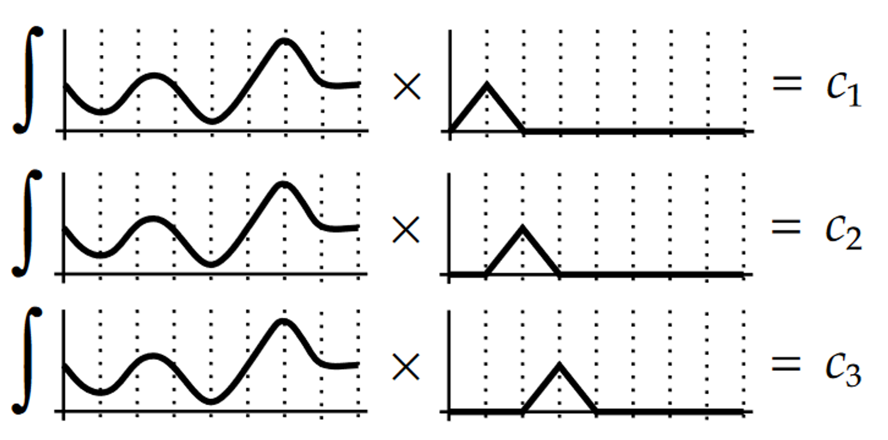
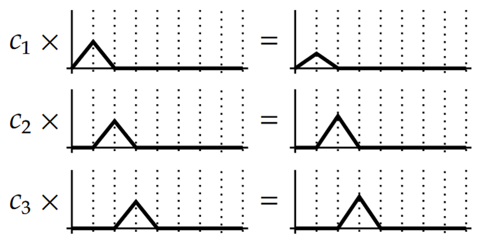
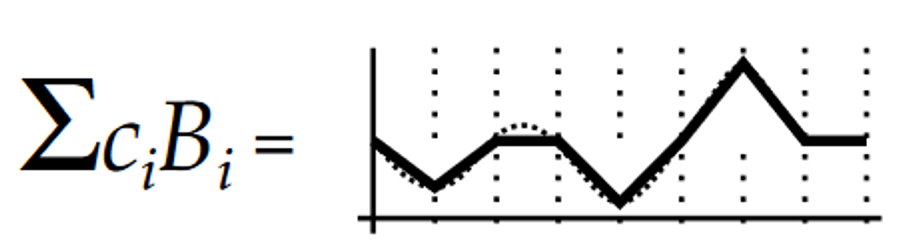
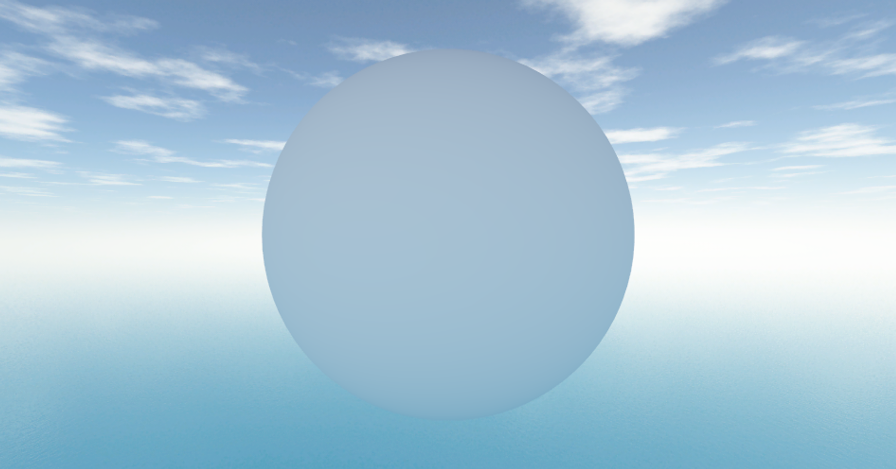
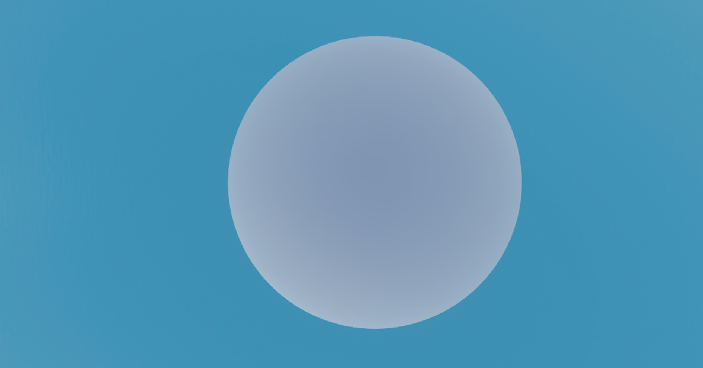
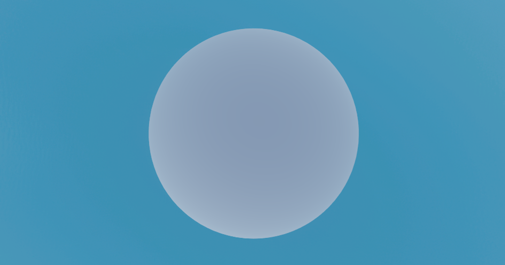
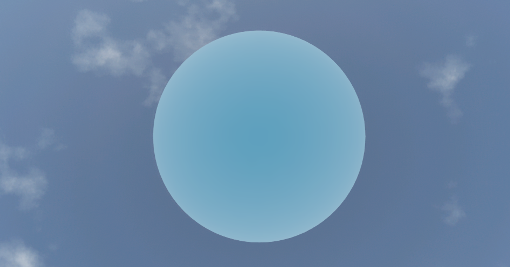
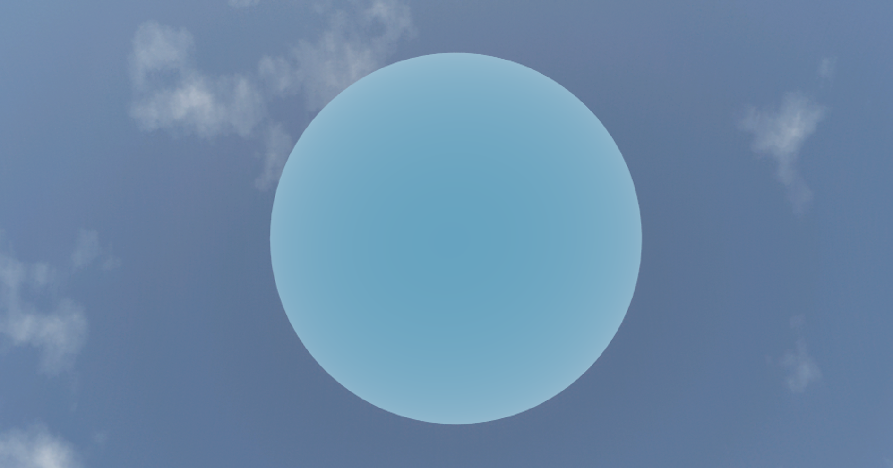

# 구면 조화 함수 (Spherical Harmonics)

> 출처: https://xtozero.tistory.com/2

# 목차

1. 개요
2. Irradiance Map
3. 버금 르장드르 다항식 (Associated Legendre Polynomials)
4. 구면 조화 함수
5. 투영 (Projection)
6. 구면 조화 함수를 이용한 Irradiance Map
7. 마치며
8. Reference

# 개요

Spherical Harmonics(이하 구면 조화 함수)는 구면 좌표계에서 정의 되는 함수입니다. 구면 조화 함수에 대한 [위키 페이지](https://ko.wikipedia.org/wiki/%EA%B5%AC%EB%A9%B4_%EC%A1%B0%ED%99%94_%ED%95%A8%EC%88%98)를 보면 다음과 같이 구면 조화 함수를 설명하고 있습니다.

> 수학과 물리학에서 구면 조화 함수(球面調和函數, 영어: spherical harmonics)는 구면에서 라플라스 방정식의 해의 정규 직교 기저다. 전자기학과 양자역학 등에서 구면 대칭인 계를 다룰 때 쓰인다.

참 난해한 설명입니다. 하지만 다행스럽게도 구면 조화 함수의 몇몇 특징을 이해한다면 렌더링 영역에서 구면 조화 함수를 도구로 사용할 수 있습니다.

여기서는 Irradiance Map을 Direct3D 11/12로 구현한 결과물을 통해 구면 조화 함수의 몇 가지 특징에 대해 살펴보도록 하겠습니다.

# Irradiance Map

Irradiance Map은 이미지를 광원으로 하는 Image Based Lighting(이하 IBL)의 일종입니다. 이 중에서 Diffuse 반사를 위해 사전에 필터링한 이미지를 Irradiance Map이라 합니다. 다음과 같이 대체로 360도 전 방향을 포함할 수 있는 큐브맵을 사용합니다.


출처 : <https://learnopengl.com/PBR/IBL/Diffuse-irradiance>

Irradiance Map은 360도 전 방향에 대하여 다음과 같은 렌더링 방정식을 계산하는 것으로 생성할 수 있습니다.

$$ {\displaystyle L_{\text{r}}(\mathbf {x} ,\omega {\text{o}})=L{\text{e}}(\mathbf {x} ,\omega _{\text{o}})+\int {\Omega }f{\text{r}}(\mathbf {x} ,\omega _{\text{i}},\omega {\text{o}})L{\text{i}}(\mathbf {x} ,\omega _{\text{i}})(\omega _{\text{i}}\cdot \mathbf {n} )\operatorname {d} \omega _{\text{i}}} $$

$L_{\text{r}}(\mathbf {x} ,\omega _{\text{o}})$ : 반사되는 radiance

$x$ : 반사 표면

$w_o,w_i$ : 빛이 나가는 방향, 빛이 들어오는 방향

$L_{\text{r}}(\mathbf {x} ,\omega _{\text{o}})$ : 표면에서 방출되는 radiance

$\Omega$ : 반구 공간

$f_{\text{r}}(\mathbf {x} ,\omega _{\text{i}},\omega _{\text{o}})$ : brdf

$L_{\text{i}}(\mathbf {x} ,\omega _{\text{i}})$ : 입사되는 radiance

Diffuse 반사에서 brdf는 대체로 Lambert BRDF가 사용되며 Lambert BRDF는 상수이기 때문에 brdf를 적분의 밖으로 빼낼 수 있습니다. 또한 반사 표면에서 방출되는 빛이 없다고 한다면 위 식을 아래와 같이 단순화할 수 있습니다.

$$ {\displaystyle L_{\text{r}}(\mathbf {x} ,\omega _{\text{o}})= \frac{\sigma}{\pi} \int {\Omega }L{\text{i}}(\mathbf {x} ,\omega _{\text{i}})(\omega _{\text{i}}\cdot \mathbf {n} )\operatorname {d} \omega _{\text{i}}} $$

여기서 Lambert BRDF를 제외하면 Irradiance가 됩니다.

$$ {\displaystyle E(\mathbf {x})= \int {\Omega }L{\text{i}}(\mathbf {x} ,\omega _{\text{i}})(\omega _{\text{i}}\cdot \mathbf {n} )\operatorname {d} \omega _{\text{i}}} $$

이제 실제 코드로 Irradiance Map을 생성하는 과정을 살펴보겠습니다. 먼저 구면 조화 함수를 사용하지 않는 경우에 어떻게 구현되는지 보겠습니다. 여기서는 원본 큐브맵(2048x2048)보다 작은 큐브맵(32x32)으로 위의 식을 일일이 계산하여 Irradiance Map을 생성합니다. 주파수가 낮은 Diffuse 반사의 특징으로 인해 작은 큐브맵을 사용하여도 텍스쳐 보간이 있기 때문에 괜찮습니다.

먼저 Irradiance Map을 위한 큐브맵을 생성하는 코드입니다.

```
agl::TextureTrait trait = cubeMap->GetTrait();
trait.m_width = trait.m_height = 32; // 원본 큐브맵에서 크기 변경
trait.m_format = agl::ResourceFormat::R8G8B8A8_UNORM_SRGB;
trait.m_bindType |= agl::ResourceBindType::RenderTarget; // 렌더 타겟으로 사용

auto irradianceMap = agl::Texture::Create( trait );
EnqueueRenderTask( [irradianceMap]()
{
		irradianceMap->Init();
} );
```

이렇게 생성된 큐브맵을 렌더 타겟으로 하고 지오메트리 셰이더를 사용하여 한 번의 드로우 콜로 모든 면에 대한 Irradiance Map을 생성합니다. 버택스 셰이더와 지오메트리 셰이더를 차례대로 보겠습니다.

버택스 셰이더입니다. 실제 정육면체 메시는 지오메트리 셰이더에서 생성할 것이므로 SV_VertexID를 사용하여 각 면에 대한 인덱스만을 지오메트리 셰이더로 전달합니다. 따라서 드로우 콜의 호출도 버텍스 버퍼와 인덱스 버퍼를 바인딩하지 않고 버택스 수를 6으로 하여 호출합니다.

```
struct VS_OUTPUT
{
    uint vertexId : VERTEXID;
};

VS_OUTPUT main( uint vertexId : SV_VertexID )
{
    VS_OUTPUT output = (VS_OUTPUT)0;
    output.vertexId = vertexId;
    
    return output;
}
```

지오메트리 셰이더입니다. 여기서 정육면체 메시에 대한 버택스를 생성하여 픽셀 셰이더로 전달합니다. 주목할 부분은 GS_OUTPUT에 SV_RenderTargetArrayIndex를 사용했다는 점입니다. 이것으로 렌더링할 큐브맵의 면을 지정할 수 있습니다.

```
struct GS_INPUT
{
    uint vertexId : VERTEXID;
};

struct GS_OUTPUT
{
    float4 position : SV_POSITION;
    float3 localPosition : POSITION0;
    uint rtIndex : SV_RenderTargetArrayIndex;
};

static const float4 projectedPos[] =
{
    { -1, -1, 0, 1 },
    { -1, 1, 0, 1 },
    { 1, -1, 0, 1 },
    { 1, 1, 0, 1 }
};
    
static const float3 vertices[] =
{
    { -1, -1, -1 },
    { -1, 1, -1 },
    { 1, -1, -1 },
    { 1, 1, -1 },
    { -1, -1, 1 },
    { -1, 1, 1 },
    { 1, -1, 1 },
    { 1, 1, 1 }
};
    
static const int4 indices[] =
{
    { 6, 7, 2, 3 },
    { 0, 1, 4, 5 },
    { 5, 1, 7, 3 },
    { 0, 4, 2, 6 },
    { 4, 5, 6, 7 },
    { 2, 3, 0, 1 }
};

[maxvertexcount(4)]
void main( point GS_INPUT input[1], inout TriangleStream<GS_OUTPUT> triStream )
{
    GS_OUTPUT output = (GS_OUTPUT)0;
    output.rtIndex = input[0].vertexId;
    
    for ( int i = 0; i < 4; ++i )
    {
        output.position = projectedPos[i];
        int index = indices[input[0].vertexId][i];
        output.localPosition = vertices[index];
        triStream.Append( output );
    }
    triStream.RestartStrip();
}
```

픽셀 셰이더를 살펴보기 전 계산해야 할 식을 정리할 필요가 있습니다.

표면에서 반사되는 radiance에 대한 식에서 시작합니다.

$$ {\displaystyle L_{\text{r}}(\mathbf {x} ,\omega _{\text{o}})= \frac{\sigma}{\pi} \int {\Omega }L{\text{i}}(\mathbf {x} ,\omega _{\text{i}})(\omega _{\text{i}}\cdot \mathbf {n} )\operatorname {d} \omega _{\text{i}}} $$

Irrdiance를 계산하고 렌더링 시 Lambert BRDF를 적용해도 되지만 Lambert BRDF가 상수이기 때문에 여기서 함께 계산하도록 합니다. 여기서 표면의 알베도인 $\sigma$는 렌더링시 곱해주면 되기 때문에 제외하여 다음과 같이 정리할 수 있습니다.

$$ \frac{1}{\pi} \int {\Omega }L{\text{i}}(\mathbf {x} ,\omega _{\text{i}})(\omega _{\text{i}}\cdot \mathbf {n} )\operatorname {d} \omega _{\text{i}} $$

이 식을 구면 좌표계에 대한 적분으로 다음과 같이 쓸 수 있습니다.

$$ \frac{1}{\pi} \int_{\phi=0}^{2\pi} \int_{\theta=0}^{\frac{\pi}{2}} L(\theta, \phi)cos(\theta) sin(\theta )d\theta d\phi $$

그리고 픽셀 셰이더에서 계산할 수 있도록 [리만합](https://en.wikipedia.org/wiki/Riemann_sum)을 통해 다음과 같은 형태로 변경합니다.

$$ \frac{1}{\pi} \frac{2\pi}{n1} \frac{\frac{\pi}{2}}{n2} \sum_{\phi = 0}^{n1}\sum_{\theta=0}^{n2} L_{\text{i}}(\mathbf {x} ,\omega _{\text{i}})cos(\theta) sin(\theta ) $$

$$ =\frac{\pi}{n1n2}\sum_{\phi = 0}^{n1}\sum_{\theta=0}^{n2} L_{\text{i}}(\mathbf {x} ,\omega _{\text{i}})cos(\theta) sin(\theta ) $$

이제 픽셀 셰이더를 살펴보겠습니다.

```
#include "Common/Constants.fxh"

TextureCube CubeMap : register( t0 );
SamplerState LinearSampler : register( s0 );

static const float SampleDelta = 0.025f;

struct PS_INPUT
{
    float4 position : SV_POSITION;
    float3 localPosition : POSITION0;
    uint rtIndex : SV_RenderTargetArrayIndex;
};

float4 main(PS_INPUT input) : SV_TARGET
{
    float3 normal = normalize( input.localPosition );

    float3 up = ( abs( normal.y ) < 0.999 ) ? float3( 0.f, 1.f, 0.f ) : float3( 0.f, 0.f, 1.f );
    float3 right = normalize( cross( up, normal ) );
    up = normalize( cross( normal, right ) );
    
    float3x3 toWorld = float3x3( right, up, normal );

    float3 irradiance = 0.f;

    float numSample = 0.f; 
    for ( float phi = 0.f; phi < 2.f * PI; phi += SampleDelta )
    {
        for ( float theta = 0.f; theta < 0.5f * PI; theta += SampleDelta )
        {
            float3 tangentSample = float3( sin( theta ) * cos( phi ), sin( theta ) * sin( phi ), cos( theta ) );
            float3 worldSample = normalize( mul( tangentSample, toWorld ) );

            irradiance += CubeMap.Sample( LinearSampler, worldSample ).rgb * cos( theta ) * sin( theta );

            ++numSample;
        }
    }
    irradiance = PI * irradiance / numSample;

    return float4( irradiance, 1.f );
}
```

결과로 다음과 같은 Irradiance Map을 얻을 수 있습니다.

|  |  |
| --- | --- |
|  |  |
| 원본 스카이 박스 | Irradiance Map |

이렇게 얻은 Irradiance Map은 조명 계산에 다음과 같이 사용됩니다.

```
float3 ImageBasedLight( float3 normal )
{
    return IrradianceMap.Sample( LinearSampler, normal ).rgb;
}

// ...

float4 lightColor = float4( ImageBasedLight( normal ), 1.f ) * MoveLinearSpace( Diffuse );
```

여기까지가 구면 조화 함수를 사용하지 않는 Irradiance Map입니다. 결과로 우리는 Irradiance Map을 위해 약 24KB( 32 * 32 * 6 * 4Byte )의 메모리를 사용하였습니다. 그런데 구면 조화 함수를 사용할 경우에는 108Byte( 3 * 9 * 4Byte )만을 사용하여도 거의 동일한 결과를 얻을 수 있습니다. 이제부터 구면 조화 함수에 대해 알아보도록 하겠습니다.

# 버금 르장드르 다항식 (Associated Legendre Polynomials)

구면 조화 함수로 들어가기 전에 버금 르장드르 다항식에 대해 먼저 살펴볼 필요가 있습니다. 이는 버금 르장드르 다항식이 구면 조화 함수에 사용되기 때문입니다.

버금 르장드르 다항식은 전통적으로 $P$로 나타내며 두 개의 인자 $l$과 $m$을 가지며 다음과 같이 나타낼 수 있습니다.

$$ P_l^m(x) $$

여기서 $x$는 -1 ~ 1이며 버금 르장드르 다항식의 결괏값은 실수를 반환합니다.

<aside> 💡 복소수를 반환하는 일반 르장드르 다항식과 혼동하지 않도록 주의해야 합니다.

</aside>

두 개의 인자 $l$과 $m$은 다항식을 함수의 대역(Bands)으로 나누는데 인자 $l$은 Band Index라 하여 0부터 시작하는 양의 정숫값을 가집니다. 그리고 $m$은 0 ~ $l$ 범위의 임의의 정수 값을 가집니다.

$$ P_0^0\\ P_1^0P_1^1\\ P_2^0P_2^1P_2^2 $$

버금 르장드르 다항식은 여러 가지 재귀 관계를 가지고 있는데 이를 통해 모든 다항식을 계산할 수 있습니다. 여기서는 3가지 식을 소개하도록 하겠습니다.

$$ 1 $$

$$ P_{m}^{m}=(-1)^{m}(2m-1)!!(1-x^{2})^{m/2} $$

이 식은 이전 결과와 연관 관계가 없기 때문에 버금 르장드르 다항식을 구하는 시작점으로 적합합니다. 여기서 $!!$는 이중 계승을 나타내는 기호로 다음과 같이 계산할 수 있습니다.

$$ n!!=\Biggl\{\begin{array}{rcl} n \cdot (n-2)...5 \cdot 3 \cdot 1, \quad n>0 odd\\ n \cdot (n-2)...6 \cdot 4 \cdot 2, \quad n>0  even\\ \end{array} $$

나머지 두 식은 이전 결과를 이용합니다.

$$ 2 $$

$$ P_{m+1}^{m}=x(2m+1)P_{m}^{m} $$

$$ 3 $$

$$ (l-m)P_{l}^{m}=x(2l-1)P_{l-1}^{m}-(l+m-1)P_{l-2}^{m} $$

$P_{0}^{0}(x)$의 값은 1이기 때문에 이를 초기 상태로 놓으면 위의 3가지 식으로 필요한 버금 르장드르 다항식을 구할 수 있습니다. 다음은 3가지 식을 통해 버금 르장드르 다항식의 값을 구하는 코드입니다.

```
double P(int l, int m, double x) 
{
    // evaluate an Associated Legendre Polynomial P(l,m,x) at x
    double pmm = 1.0;
    if (m > 0)
    {
        double somx2 = sqrt((1.0 - x) * (1.0 + x))
        double fact = 1.0;
        for (int i = 1; i <= m; i++) 
        {
            pmm *= (-fact) * somx2;
            fact += 2.0;
        }
    }
    if (l == m) return pmm;
    double pmmp1 = x * (2.0 * m + 1.0) * pmm;
    if (l == m + 1) return pmmp1;
    double pll = 0.0;
    for (int ll = m + 2; ll <= l; ++ll) 
    {
        pll = ((2.0 * ll - 1.0) * x * pmmp1 - (ll + m - 1.0) * pmm) / (ll - m);
        pmm = pmmp1;
        pmmp1 = pll;
    }
    return pll;
}
```

# 구면 조화 함수

Spherical Harmonics를 검색했을 때 나오는 일반적인 구면 조화 함수는 다음과 같습니다.

$$ Y_{l}^{m}(θ,ϕ):=AP_{l}^{m}(cosθ)e^{imϕ} $$

일반적인 버금 르장드르 다항식과 마찬가지로 일반적인 구면 조화 함수도 복소수를 반환하는데 우리는 실수에 관심이 있습니다. 따라서 여기서는 실수 구면 조화 함수에 대해서 알아볼 것입니다.

실수 구면 조화 함수는 다음과 같습니다.

$$ y_{l}^{m}(\theta,\varphi)=\Biggl\{\begin{array}{rcl} \sqrt{2}K_{l}^{m}cos(m\varphi)P_{l}^{m}(cos\theta), \quad m > 0\\ \sqrt{2}K_{l}^{m}sin(-m\varphi)P_{l}^{-m}(cos\theta), \quad m < 0\\ K_{l}^{0}P_{l}^{0}(cos\theta), \quad m = 0\\ \end{array} $$

여기서 $P$는 앞에서 살펴본 버금 르장드르 다항식이며 $K$는 정규화를 위한 배율 계수입니다.

$$ K_{l}^{m}=\sqrt{\frac{(2l+1)}{4\pi}\frac{(l-|m|)!}{(l+|m|)!}} $$

모든 구면 조화 함수에서 $l$과 $m$은 버금 르장드르 다항식과 조금 다르게 정의됩니다. $l$은 여전히 0에서 시작하는 양의 정수이지만 $m$은 $-l$과 $l$사이의 정수입니다.

$$ y_{0}^{0}\\y_{1}^{-1} \enskip y_{1}^{0} \enskip y_{1}^{1}\\y_{2}^{-2} \enskip y_{2}^{-1} \enskip y_{2}^{0} \enskip y_{2}^{1} \enskip y_{2}^{2}

$$

이를 그래프로 나타내면 다음과 같습니다.


출처 : [https://users.soe.ucsc.edu/~pang/160/s13/projects/bgabin/Final/report/Spherical Harmonic Lighting Comparison.htm](https://users.soe.ucsc.edu/~pang/160/s13/projects/bgabin/Final/report/Spherical%20Harmonic Lighting Comparison.htm)

위 그래프는 구면 좌표계에서 그려진 구면 조화 함수의 그래프로 초록색은 함수가 양인 구역 붉은색은 함수가 음인 구역을 나타냅니다.

다음은 구면 조화 함수를 구하는 코드입니다.

```
double K(int l, int m)
{
    // renormalisation constant for SH function
    double temp = ((2.0 * l + 1.0) * factorial(l - m)) / (4.0 * PI * factorial(l + m));
    return sqrt(temp);
}

double SH(int l, int m, double theta, double phi) 
{
    // return a point sample of a Spherical Harmonic basis function
    // l is the band, range [0..N]
    // m in the range [-l..l]
    // theta in the range [0..Pi]
    // phi in the range [0..2*Pi]
    const double sqrt2 = sqrt(2.0);
    if (m == 0) return K(l, 0) * P(l, m, cos(theta));
    else if (m > 0) return sqrt2 * K(l, m) * cos(m * phi) * P(l, m, cos(theta));
    else return sqrt2 * K(l, -m) * sin(-m * phi) * P(l, -m, cos(theta));
}
```

버금 르장드르 다항식에 팩토리얼까지 구면 조화 함수를 구하는 과정은 꽤 복잡합니다. 하지만 실제 구현에서 사용되는 구면 조화 함수는 [미리 계산해 놓은 것](https://en.wikipedia.org/wiki/Table_of_spherical_harmonics)이 있기 때문에 매우 간단하게 구할 수 있습니다. 우선 구면 좌표계를 익숙한 데카르트 좌표계로 다음과 같이 바꿀 수 있습니다.

$$ (x,y,z)=(sin{\theta}cos{\phi},sin{\theta}sin{\phi},cos{\theta}) $$

그리고 이를 이용하여 구면 조화 함수를 다음과 같이 풀어 사용할 수 있습니다. 다음은 $l=2$까지의 구면 조화 함수입니다.

$$ y_{0}^{0}(\vec{n})=0.282095\\ y_{1}^{-1}(\vec{n})=0.488603y\\ y_{1}^{0}(\vec{n})=0.488603z\\ y_{1}^{1}(\vec{n})=0.488603x\\ y_{2}^{-2}(\vec{n})=1.092548xy\\ y_{2}^{-1}(\vec{n})=1.092548yz\\ y_{2}^{0}(\vec{n})=0.315392(3z^2-1)\\ y_{2}^{1}(\vec{n})=1.092548xz\\ y_{2}^{2}(\vec{n})=0.546274(x^2-y^2)\\ $$

# 투영 (Projection)

이제 우리는 구면 조화 함수를 구할 수 있습니다. 그럼 본래의 목적으로 돌아와서 어떻게 하면 Irradiance Map을 구면 조화 함수를 이용하여 최적화 할 수 있을까요? 여기서 기저 함수(Basis Function)와 투영(Projection)에 대해 살펴볼 필요가 있습니다.

기저 함수는 선형 조합을 통해 원래 함수의 근사치를 생성할 수 있는 함수입니다. 즉 다음과 같이 기저 함수에 계수를 곱하고 각각을 더함으로써 원래의 함수를 근사합니다.

$$ f(x)=c_1b_1(x)+c_2b_2(x)+c_3b_3(x)+c_4b_4(x)+... $$

기저 함수에 곱해질 계수를 구하는 과정을 투영이라고 합니다. 투영을 통해 계수를 얻기 위해서는 원본 함수의 전체 영역에 걸쳐 기저 함수와의 곱을 적분하면 됩니다.

$$ c_i=\int{f(x)b_i(x)} $$

투영 과정을 그림으로 살펴보면 다음과 같습니다.



출처 : [Spherical Harmonic Lighting: The Gritty Details](https://3dvar.com/Green2003Spherical.pdf)

그리고 원래 함수를 복원하는 과정을 그림으로 살펴보면 다음과 같습니다.



출처 : [Spherical Harmonic Lighting: The Gritty Details](https://3dvar.com/Green2003Spherical.pdf)



출처 : [Spherical Harmonic Lighting: The Gritty Details](https://3dvar.com/Green2003Spherical.pdf)

이러한 성질을 이용하여 구면 조화 함수를 통해 Irradiance Map을 최적화할 수 있습니다.

# 구면 조화 함수를 이용한 Irradiance Map

구면 조화 함수를 이용한 Irradiance Map 구현을 살펴보겠습니다.

$$ \frac{1}{\pi} \int_{\phi=0}^{2\pi} \int_{\theta=0}^{\frac{\pi}{2}} L_{\text{i}}(\mathbf {x} ,\omega _{\text{i}})cos(\theta) sin(\theta )d\theta d\phi $$

위 수식을 다음과 같이 2가지로 나눕니다.

1. $\int_{\phi=0}^{2\pi} \int_{\theta=0}^{\pi} L_{\text{i}}(\mathbf {x} ,\omega _{\text{i}}) sin(\theta )d\theta d\phi$ → 반구에 대한 적분에서 구 전체에 대한 적분으로 변경되었습니다.
2. $max(cos(\theta), 0)$ → 양수의 범위로 제한합니다. 구 전체에 대한 Radiance의 적분과 곱해지면 반구의 반대편은 0이 되어 반구에 대한 Radiance만 남게 됩니다.

그리고 투영을 통해 각각에 대한 구면 조화 함수의 계수를 구합니다.

$$ L_{lm}=\int_{\phi=0}^{2\pi} \int_{\theta=0}^{\pi} L(\theta, \phi) y_{l}^{m}(\theta,\phi) sin(\theta )d\theta d\phi $$

$$ A_{l}=\int_{\theta=0}^{\pi} max(cos(\theta),0)y_{l}^{0}(\theta,0)d\theta $$

여기서 $cos(\theta)$는 천정 각(Zenith Angle)에만 영향을 받기 때문에 $m$은 항상 0이 됩니다. 이렇게 얻어낸 계수 $L_{lm}$과 $A_{l}$를 통해 Irradiance를 복원할 수 있습니다. Irradiance의 구면조화 함수 계수를 $E_{lm}$이라 할 때 Irradiance는 다음과 같이 복원됩니다.

$$ E(\theta,\phi)=\sum_{l,m} E_{lm}y_l^m(\theta, \phi) $$

이때 $E_{lm}$은 $L_{lm}$과 $A_{l}$로 다음과 같이 나타낼 수 있습니다.

$$ E_{lm}=\sqrt{\frac{4\pi}{2l +1}}A_lL_{lm} $$

여기서 $\sqrt{\frac{4\pi}{2l +1}}$은 로컬 좌표에서 계산된 $cos(\theta)$의 구면 조화 함수 계수를 월드 좌표로 회전시키기 위한 가중치 값입니다. 자세한 유도 과정은 [레퍼런스 4번](https://cseweb.ucsd.edu/~ravir/papers/invlamb/josa.pdf) 의 4.A에서 설명하고 있습니다.

편의를 위해 새로운 변수 $\hat{A_l}$를 다음과 같이 정의합니다.

$$ \hat{A_l}=\sqrt{\frac{4\pi}{2l +1}}A_l $$

$\hat{A_l}$는 미리 계산한 상수로 사용되며 다음과 같습니다.

$$ \hat{A_0}=3.1415\\ \hat{A_1}=2.0943\\ \hat{A_2}=0.7853\\ \hat{A_3}=0\\ \hat{A_4}=−0.1309\\ \hat{A_5}=0\\ \hat{A_6}=0.0490 $$

이를 그래프로 나타내면 다음과 같은데 보시다시피 수치가 빠르게 감소하는 것을 알 수 있습니다.


출처 : [On the relationship between radiance and irradiance: determining the illumination from images of a convex Lambertian object](https://cseweb.ucsd.edu/~ravir/papers/invlamb/josa.pdf)

따라서 $l ≤ 2$의 낮은 주파수의 구면 조화 함수로도 충분하기 때문에 27개의 계수(RGB 색상 3개 * SH 계수 9개)만으로 Irradiance Map을 근사할 수 있습니다. 따라서 셰이더 코드에서 구면 조화 함수 $y_{l}^{m}(\vec{n})$을 구하는 함수는 다음과 같이 작성됩니다.

```
void ShFunctionL2( float3 v, out float Y[9] )
{
    // L0
    Y[0] = 0.282095f; // Y_00
    
    // L1
    Y[1] = 0.488603f * v.y; // Y_1-1
    Y[2] = 0.488603f * v.z; // Y_10
    Y[3] = 0.488603f * v.x; // Y_11

    // L2
    Y[4] = 1.092548f * v.x * v.y; // Y_2-2
    Y[5] = 1.092548f * v.y * v.z; // Y_2-1
    Y[6] = 0.315392f * ( 3.f * v.z * v.z - 1.f ) ; // Y_20
    Y[7] = 1.092548f * v.x * v.z; // Y_21
    Y[8] = 0.546274f * ( v.x * v.x - v.y * v.y ); // Y_22
}
```

이어서 $L_{lm}$을 구하는 컴퓨트 셰이더 코드를 살펴보겠습니다. 이 컴퓨트 셰이더 코드는 아래의 수식을 계산합니다.

$$ L_{lm}=\frac{1}{\pi}\int_{\phi=0}^{2\pi} \int_{\theta=0}^{\pi} L(\theta, \phi) y_{l}^{m}(\theta,\phi) sin(\theta )d\theta d\phi $$

$$ = \frac{1}{\pi} \frac{2\pi}{n1} \frac{\pi}{n2} \sum_{\phi=0}^{n1} \sum_{\theta=0}^{n2}L(\theta, \phi) y_{l}^{m}(\theta,\phi) sin(\theta ) $$

$$ = \frac{2\pi}{n1n2} \sum_{\phi=0}^{n1} \sum_{\theta=0}^{n2}L(\theta, \phi) y_{l}^{m}(\theta,\phi) sin(\theta ) $$

```
#include "Common/Constants.fxh"
#include "SH/SphericalHarmonics.fxh"

TextureCube CubeMap : register( t0 );
SamplerState LinearSampler : register( s0 );
RWStructuredBuffer<float3> Coeffs : register( u0 );

static const int ThreadGroupX = 16;
static const int ThreadGroupY = 16;

static const float3 Black = (float3)0;
static const float SampleDelta = 0.025f;
static const float DeltaPhi = SampleDelta * ThreadGroupX;
static const float DeltaTheta = SampleDelta * ThreadGroupY;

groupshared float3 SharedCoeffs[ThreadGroupX * ThreadGroupY][9];
groupshared int TotalSample;

[numthreads(ThreadGroupX, ThreadGroupY, 1)]
void main( uint3 GTid: SV_GroupThreadID, uint GI : SV_GroupIndex)
{
    if ( GI == 0 )
    {
        TotalSample = 0;
    }

    GroupMemoryBarrierWithGroupSync();

    float3 coeffs[9] = { Black, Black, Black, Black, Black, Black, Black, Black, Black };
    int numSample = 0; 
    for ( float phi = GTid.x * SampleDelta; phi < 2.f * PI; phi += DeltaPhi )
    {
        for ( float theta = GTid.y * SampleDelta; theta < PI; theta += DeltaTheta )
        {
            float3 sampleDir = normalize( float3( sin( theta ) * cos( phi ), sin( theta ) * sin( phi ), cos( theta ) ) );
            float3 radiance = CubeMap.SampleLevel( LinearSampler, sampleDir, 0 ).rgb;

            float y[9];
            ShFunctionL2( sampleDir, y );

            [unroll]
            for ( int i = 0; i < 9; ++i )
            {
                coeffs[i] += radiance * y[i] * sin( theta );
            }

            ++numSample;
        }
    }

    int sharedIndex = GTid.y * ThreadGroupX + GTid.x;

    [unroll]
    for ( int i = 0; i < 9; ++i )
    {
        SharedCoeffs[sharedIndex][i] = coeffs[i];
        coeffs[i] = Black;
    }

    InterlockedAdd( TotalSample, numSample );

    GroupMemoryBarrierWithGroupSync();

    if ( GI == 0 )
    {
        for ( int i = 0; i < ThreadGroupX * ThreadGroupY; ++i )
        {
            [unroll]
            for ( int j = 0; j < 9; ++j )
            {
                coeffs[j] += SharedCoeffs[i][j];
            }
        }

        float dOmega = 2.f * PI / float( TotalSample );

        [unroll]
        for ( int i = 0; i < 9; ++i )
        {
            Coeffs[i] = coeffs[i] * dOmega;
        }
    }
}
```

이렇게 계산된 $L_{lm}$은 조명 계산에서 다음과 같이 사용됩니다.

```
float3 ImageBasedLight( float3 normal )
{
	float3 l00 = { IrradianceMapSH[0].x, IrradianceMapSH[0].y, IrradianceMapSH[0].z }; // L00
	float3 l1_1 = { IrradianceMapSH[0].w, IrradianceMapSH[1].x, IrradianceMapSH[1].y }; // L1-1
	float3 l10 = { IrradianceMapSH[1].z, IrradianceMapSH[1].w, IrradianceMapSH[2].x }; // L10
	float3 l11 = { IrradianceMapSH[2].y, IrradianceMapSH[2].z, IrradianceMapSH[2].w }; // L11
	float3 l2_2 = { IrradianceMapSH[3].x, IrradianceMapSH[3].y, IrradianceMapSH[3].z }; // L2-2
	float3 l2_1 = { IrradianceMapSH[3].w, IrradianceMapSH[4].x, IrradianceMapSH[4].y }; // L2-1
	float3 l20 = { IrradianceMapSH[4].z, IrradianceMapSH[4].w, IrradianceMapSH[5].x }; // L20
	float3 l21 = { IrradianceMapSH[5].y, IrradianceMapSH[5].z, IrradianceMapSH[5].w }; // L21
	float3 l22 = { IrradianceMapSH[6].x, IrradianceMapSH[6].y, IrradianceMapSH[6].z }; // L22

	static const float c1 = 0.429043f;
	static const float c2 = 0.511664f;
	static const float c3 = 0.743125f;
	static const float c4 = 0.886227f;
	static const float c5 = 0.247708f;

	return c1 * l22 * ( normal.x * normal.x - normal.y * normal.y ) + c3 * l20 * normal.z * normal.z + c4 * l00 - c5 * l20
		+ 2.f * c1 * ( l2_2 * normal.x * normal.y + l21 * normal.x * normal.z + l2_1 * normal.y * normal.z )
		+ 2.f * c2 * ( l11 * normal.x + l1_1 * normal.y + l10 * normal.z );
}
```

위 코드는 [레퍼런스 3](https://graphics.stanford.edu/papers/envmap/)의 3.2에서 소개된 최적화된 렌더링 식을 코드로 작성하였습니다.

$$ E(n)=c_1L_{22}(x^2-y^2)+c_3L_{20}z^2+c_4L_{00}-c_5L_{20}\\+2c_1(L_{2-2}xy+L{21}xz+L_{2-1}yz)\\+2c_2(L_{11}x+L_{1-1}y+L_{10}z) $$

$$ c_1=0.429043 \\c_2=0.511664 \\c_3=0.743125 \\c_4=0.886227 \\c_5=0.247708 $$

|  |  |
| --- | --- |
| 구면 조화 함수 미사용 | 구면 조화 함수 사용 |
|  |  |
| 정면 | 정면 |
|  |  |
| 위 | 위 |
|  |  |
| 아래 | 아래 |

# 마치며

준비한 내용은 여기까지입니다.

전체 코드는 아래의 링크를 참고하시면 됩니다.

[GitHub - xtozero/SSR at irradiance_map](https://github.com/xtozero/ssr/tree/irradiance_map)

# Reference

1. [Diffuse irradiance](https://learnopengl.com/PBR/IBL/Diffuse-irradiance)
2. [Spherical Harmonic Lighting: The Gritty Details](https://3dvar.com/Green2003Spherical.pdf)
3. [An Efficient Representation for Irradiance Environment Maps](https://graphics.stanford.edu/papers/envmap/)
4. [On the relationship between radiance and irradiance: determining the illumination from images of a convex Lambertian object](https://cseweb.ucsd.edu/~ravir/papers/invlamb/josa.pdf)
5. [Diffuse IrradianceMap과 Spherical harmonics를 통한 최적화](https://scahp.tistory.com/61)

<https://xtozero.notion.site/Spherical-Harmonics-51b24329012b4509b97001ae9a1b32d2?pvs=4>

[Spherical Harmonics

목차

xtozero.notion.site](https://xtozero.notion.site/Spherical-Harmonics-51b24329012b4509b97001ae9a1b32d2?pvs=4)
