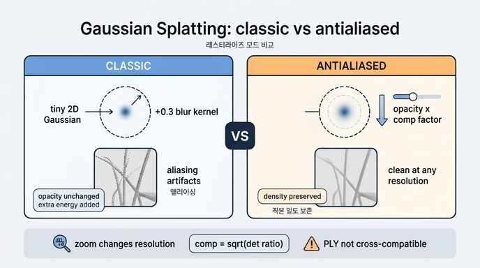

# rasterize_mode: "classic" vs "antialiased"

## 질문
rasterize_mode의 "classic"과 "antialiased"는 어떻게 다른가?

## 핵심 답변
- **classic**: EWA volume splatting에 **[0.3, 0.3] 화면 공간(screen space) 블러 커널**을 고정으로 더해 렌더링한다. 촬영 해상도와 다른(더 높거나 낮은) 해상도로 아주 작은 가우시안을 렌더링하면 **앨리어싱 같은(aliasing-like) 아티팩트**가 생긴다.
- **antialiased**: 각 가우시안에 대해 **보정 계수(compensation factor)를 계산해 불투명도(opacity)에 곱함**으로써 splat의 **총 적분 밀도(total integrated density)를 보존**한다. Mip-Splatting 계열 기법으로, 위 아티팩트를 해결한다.

## 코드 위치 (splatfacto.py)

`SplatfactoModelConfig`의 설정 필드:

```python
rasterize_mode: Literal["classic", "antialiased"] = "classic"
"""
Classic mode of rendering will use the EWA volume splatting with a [0.3, 0.3] screen space blurring kernel. This
approach is however not suitable to render tiny gaussians at higher or lower resolution than the captured, which
results "aliasing-like" artifacts. The antialiased mode overcomes this limitation by calculating compensation factors
and apply them to the opacities of gaussians to preserve the total integrated density of splats.

However, PLY exported with antialiased rasterize mode is not compatible with classic mode. Thus many web viewers that
were implemented for classic mode can not render antialiased mode PLY properly without modifications.
"""
```

`get_outputs()`에서는 값 검증 후 gsplat의 `rasterization()`에 그대로 전달한다 — 실제 보정 계산은 gsplat 라이브러리 내부에서 수행된다:

```python
if self.config.rasterize_mode not in ["antialiased", "classic"]:
    raise ValueError("Unknown rasterize_mode: %s", self.config.rasterize_mode)
...
render, alpha, self.info = rasterization(
    ...,
    rasterize_mode=self.config.rasterize_mode,
)
```

## 왜 classic에서 문제가 생기나 (원리)

1. **화면 공간 블러(dilation)의 역할**: 3D 가우시안을 2D로 투영한 공분산에 고정 상수(≈0.3 픽셀²)를 더하는 것은, 투영된 splat이 1픽셀보다 작아져 샘플링 사이로 "빠져나가는" 것을 막기 위한 최소 크기 보장 장치다(EWA splatting의 low-pass 필터 근사).
2. **부작용**: 이 dilation은 splat을 인위적으로 키우지만 **불투명도는 그대로 두므로**, splat이 실제보다 더 많은 에너지(적분 밀도)를 뿌리게 된다. 촬영 해상도에서는 학습이 이 왜곡까지 흡수해 버리지만, 해상도(또는 카메라 거리)를 바꾸면 왜곡의 크기가 달라져 팽창(dilation) 아티팩트·앨리어싱·밝기 변화가 드러난다.
3. **antialiased의 해법**: dilation 전후 2D 공분산의 행렬식 비율로 보정 계수
   `comp = sqrt( det(Σ2D) / det(Σ2D + 0.3·I) )`
   를 구해 opacity에 곱한다. 커널이 커진 만큼 불투명도를 낮춰 **splat 하나가 화면에 뿌리는 총 밀도를 일정하게 유지**하므로, 해상도가 달라져도 일관된 결과를 얻는다. 이것이 Mip-Splatting(Yu et al., CVPR 2024)에서 제안된 2D Mip 필터 아이디어와 같은 계열이다.

## 실무 주의점: PLY 호환성
- antialiased 모드로 학습·내보낸 PLY는 opacity가 "보정 계수가 곱해질 것"을 전제로 학습된 값이라, **classic 방식 렌더러(대부분의 웹 뷰어)에서 그대로 열면 올바르게 보이지 않는다**.
- 반대로 classic용 PLY를 antialiased 렌더러로 여는 경우도 마찬가지로 불일치가 생긴다. 즉 **학습 시 모드와 뷰어의 렌더링 방식이 일치해야 한다**.

## 요약 비교

| | classic | antialiased |
|---|---|---|
| 블러 처리 | 고정 [0.3, 0.3] 커널을 2D 공분산에 더함 | 동일하게 더하되 보정 계수 계산 |
| opacity | 그대로 사용 | 보정 계수를 곱해 감쇠 |
| 적분 밀도 | 해상도에 따라 왜곡 | 보존됨 |
| 다른 해상도 렌더링 | 앨리어싱류 아티팩트 | 안정적 (Mip-Splatting 계열) |
| PLY 호환성 | 대부분의 웹 뷰어 기준 | classic 뷰어와 비호환 |

## 인포그래픽


