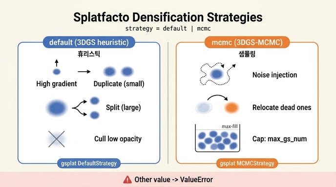

# Splatfacto의 densification 전략 두 가지

**Q. Splatfacto가 지원하는 densification 전략 두 가지는 무엇인가?**

**A.** `strategy="default"`는 원조 3DGS의 split/duplicate/cull 휴리스틱(gsplat `DefaultStrategy`)이고, `strategy="mcmc"`는 3DGS-MCMC 논문의 MCMC 샘플링 기반 전략(gsplat `MCMCStrategy`)이다. 그 외 값은 `ValueError`를 발생시킨다.

## Densification이란?

Gaussian Splatting 학습은 SfM 포인트(또는 랜덤 포인트)에서 시작한 초기 가우시안 집합만으로는 장면의 디테일을 다 표현하지 못한다. 그래서 학습 중 주기적으로 **가우시안을 늘리고(densify) 불필요한 것을 제거(prune/cull)** 하는 과정이 필요하며, 이 정책을 "전략(strategy)"이라고 부른다. Splatfacto는 이 로직을 직접 구현하지 않고 **gsplat 라이브러리의 전략 클래스**에 위임한다:

```python
from gsplat.strategy import DefaultStrategy, MCMCStrategy
```

선택은 config의 한 필드로 이루어진다:

```python
strategy: Literal["default", "mcmc"] = "default"
```

## 1. `strategy="default"` — 원조 3DGS 휴리스틱 (gsplat `DefaultStrategy`)

Kerbl et al.의 원조 3DGS 논문(SIGGRAPH 2023)에서 제안된 **adaptive density control** 휴리스틱이다. 핵심 규칙:

- **Grow (densify)**: 화면 공간 positional gradient가 임계값(`densify_grad_thresh`, 기본 0.0008)을 넘는 가우시안은 재구성이 부족한 영역에 있다고 판단해 증식한다.
  - 크기가 `densify_size_thresh`(0.01)보다 **작으면 duplicate**(복제해서 under-reconstruction 채움)
  - 그보다 **크면 split**(작은 가우시안 여러 개로 분할해 over-reconstruction 해소)
- **Cull (prune)**: 불투명도가 `cull_alpha_thresh`(0.1) 미만이거나, 월드/화면 공간에서 지나치게 큰(`cull_scale_thresh`, `cull_screen_size`) 가우시안을 제거한다.
- **Opacity reset**: `reset_alpha_every`(30 refine 주기)마다 모든 불투명도를 리셋해 floater를 정리한다.
- `use_absgrad=True`(AbsGS 논문 기법)로 gradient의 절대값 합을 기준으로 사용해 densify 감도를 높인다.

Splatfacto는 `cull_alpha_thresh`, `densify_grad_thresh`, `densify_size_thresh`, `split_screen_size`, `warmup_length`, `stop_split_at`, `refine_every` 등의 config 값을 `DefaultStrategy(prune_opa=..., grow_grad2d=..., grow_scale3d=..., ...)` 인자로 매핑해 넘긴다.

## 2. `strategy="mcmc"` — 3DGS-MCMC 샘플링 전략 (gsplat `MCMCStrategy`)

Kheradmand et al.의 **"3D Gaussian Splatting as Markov Chain Monte Carlo"** 논문(NeurIPS 2024) 기반. 가우시안 집합을 장면 분포에서 뽑은 **MCMC 샘플**로 해석해, 휴리스틱한 clone/split 대신:

- 학습 업데이트를 **Stochastic Gradient Langevin Dynamics**처럼 취급해 위치에 노이즈를 주입한다 (`noise_lr`, 기본 5e5).
- 죽은(불투명도가 `min_opacity` = `cull_alpha_thresh` 미만) 가우시안을 삭제하는 대신 **살아있는 가우시안 위치로 재배치(relocation)** 한다 — 총 확률 분포를 보존하는 state transition.
- 가우시안 총 개수를 명시적 상한 `cap_max`(`max_gs_num`, 기본 1,000,000)로 제어한다 — 메모리 예산을 직접 정할 수 있다는 것이 실용적 장점.
- 정규화 항이 손실에 추가된다: `mcmc_opacity_reg`(0.01) × mean|sigmoid(opacity)|, `mcmc_scale_reg`(0.01) × mean|exp(scale)| — 불필요한 가우시안이 스스로 투명·축소되도록 유도.

## 그 외 값 → ValueError

`populate_modules()`의 분기 마지막 else에서 명시적으로 실패한다:

```python
else:
    raise ValueError(f"""Splatfacto does not support strategy {self.config.strategy}
                     Currently, the supported strategies include default and mcmc.""")
```

## 학습 루프에서의 차이

두 전략 모두 gsplat의 콜백 인터페이스를 따른다:

- `step_pre_backward`: `DefaultStrategy`만 실제로 필요(2D gradient 추적을 위해 `info`의 gradient retain).
- `step_post_backward`: 매 스텝 후 호출되며, `DefaultStrategy`는 `packed=False`를, `MCMCStrategy`는 현재 학습률 `lr`을 추가 인자로 받는다(노이즈 주입 크기가 lr에 비례하므로). 여기서도 알 수 없는 전략이면 `ValueError`를 던진다.
- 렌더링 시 `absgrad` 옵션은 `isinstance(self.strategy, DefaultStrategy)`일 때만 활성화된다.

## 요약 대비표

| | `default` | `mcmc` |
|---|---|---|
| 출처 | 3DGS 원논문 (SIGGRAPH 2023) | 3DGS-MCMC (NeurIPS 2024) |
| gsplat 클래스 | `DefaultStrategy` | `MCMCStrategy` |
| 증식 방식 | gradient 임계값 기반 duplicate/split | 노이즈 주입 + relocation 샘플링 |
| 제거 방식 | cull (삭제) + opacity reset | 죽은 가우시안을 재배치 (개수 보존) |
| 개수 제어 | 간접적 (임계값들로) | 직접적 (`max_gs_num` 상한) |
| 추가 손실 | 없음 | opacity/scale 정규화 항 |

## 인포그래픽


