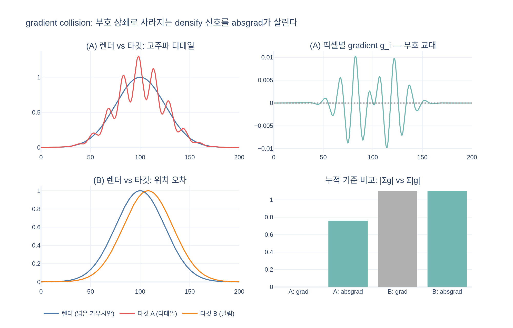

# Splatfacto의 `use_absgrad` 옵션은 무엇인가?

## 한 줄 요약

densify(가우시안 분할/복제) 판단 기준으로 일반 gradient 합 대신 **픽셀별 gradient의 절대값 합(absgrad)** 을 쓰는 옵션. AbsGS 논문("AbsGS: Recovering Fine Details for 3D Gaussian Splatting", ACM MM 2024, arXiv 2404.10484)의 기법이며 Splatfacto의 **기본값은 `True`** 다.

## 코드 위치 (splatfacto.py)

**1. Config 정의 (107–108행)** — 기본값 True:

```python
use_absgrad: bool = True
"""Whether to use absgrad to densify gaussians, if False, will use grad rather than absgrad"""
```

**2. `DefaultStrategy`에 전달 (277행)** — gsplat의 densification 전략에 넘겨짐:

```python
self.strategy = DefaultStrategy(
    ...
    grow_grad2d=self.config.densify_grad_thresh,  # 0.0008
    ...
    absgrad=self.config.use_absgrad,
    ...
)
```

**3. rasterization 호출에 전달 (571행)** — 래스터라이저가 backward에서 absgrad를 별도로 누적하도록 지시:

```python
absgrad=self.strategy.absgrad if isinstance(self.strategy, DefaultStrategy) else False,
```

`absgrad=True`면 gsplat backward가 `info["means2d"].absgrad`에 픽셀별 gradient의 **절대값 누적**을 추가로 저장하고, `DefaultStrategy`가 이 값을 `grow_grad2d` 임계값(=`densify_grad_thresh`)과 비교해 split/duplicate를 결정한다. MCMC 전략에서는 gradient 기반 densify를 쓰지 않으므로 `False`로 고정된다.

## 왜 필요한가 — gradient collision (AbsGS의 문제 제기)

원조 3DGS의 adaptive density control은 각 가우시안의 **view-space 위치 gradient 누적 norm**이 임계값을 넘으면 그 가우시안을 split/clone한다. 직관은 "재구성이 안 된 곳의 가우시안은 gradient가 크다"인데, 여기에 함정이 있다:

- 하나의 가우시안이 화면의 **많은 픽셀**을 덮으면, 최종 gradient는 픽셀별 gradient의 **합**이다:
  $$g = \sum_{i \in \text{pixels}} g_i$$
- 고주파 디테일 위에 큰 가우시안이 퍼져 있으면(over-reconstruction) 픽셀별 residual의 **부호가 번갈아** 나타나고, 그에 따라 $g_i$의 부호도 엇갈린다.
- 결과적으로 큰 $g_i$들이 **서로 상쇄(gradient collision)** 되어 $\|\sum g_i\| \approx 0$ — 명백히 잘못 그려진 큰 blur 가우시안인데도 임계값을 못 넘어 **split되지 않고** 그대로 남는다. 이것이 3DGS의 흐릿한(over-reconstructed) 영역의 주원인이라는 것이 AbsGS의 분석이다.

## AbsGS의 해법 — homodirectional (절대값) gradient

부호 상쇄를 없애기 위해 픽셀별 gradient의 성분별 **절대값을 먼저 취한 뒤 합산**한다 (논문 용어로 *homodirectional view-space positional gradient*):

$$g_{\text{abs}} = \sum_{i \in \text{pixels}} \left( |g_i^x|,\; |g_i^y| \right)$$

- 부호가 엇갈려도 각 픽셀의 오차 기여가 그대로 누적되므로, 넓게 퍼져 디테일을 뭉개는 가우시안이 **확실하게 임계값을 넘어 split** 된다.
- 결과: 고주파 디테일 복원 품질 향상, 비슷하거나 더 적은 메모리(불필요한 소형 가우시안 난립 대신 정말 필요한 곳을 분할).

## 실무 포인트

- absgrad는 절대값 합이라 일반 grad보다 값이 항상 크거나 같다. 그래서 임계값도 같이 조정된다 — 원조 3DGS의 `densify_grad_thresh`는 0.0002지만 Splatfacto 기본값은 **0.0008** (105–106행)로, absgrad 사용을 전제로 한 값이다. `use_absgrad=False`로 끄면 임계값도 낮춰야 비슷한 densify 강도가 된다.
- gsplat의 `DefaultStrategy` 문서도 absgrad 사용 시 더 높은 `grow_grad2d`를 권장한다.

Sources: [AbsGS 논문 (arXiv 2404.10484)](https://arxiv.org/pdf/2404.10484), [AbsGS 프로젝트 페이지](https://ty424.github.io/AbsGS.github.io/), [ACM MM 2024](https://dl.acm.org/doi/10.1145/3664647.3681361), [AbsGS GitHub](https://github.com/TY424/AbsGS)

## 시각화


