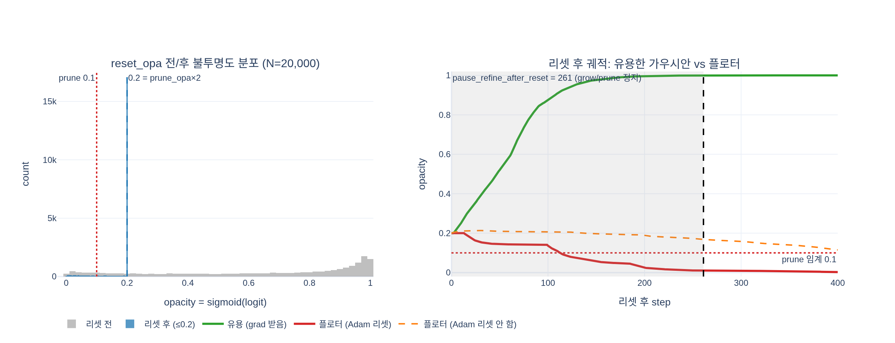

# 알파 리셋(`reset_opa`)의 동작과 목적

## 한 줄 답
3000스텝마다(`step % reset_every == 0`, step 0 포함) 모든 가우시안의 불투명도 로짓을

$$\tilde\alpha_i \leftarrow \min\big(\tilde\alpha_i,\ \mathrm{logit}(0.2)\big),\qquad 0.2 = \texttt{prune\_opa}(0.1)\times 2$$

로 **위에서 clamp**하고, 동시에 opacities 파라미터의 Adam 상태(`exp_avg`, `exp_avg_sq`)를 0으로 지운다. 모든 가우시안이 일단 반투명(≤0.2)으로 돌아가므로, 이후 손실 그래디언트를 받아 다시 불투명해지는 것만 살아남고 그렇지 못한 것(플로터·가려진·중복 가우시안)은 다음 `_prune_gs`(임계 0.1)에서 걸러진다.

## 1. 어디서, 어떤 값으로 호출되나
gsplat `DefaultStrategy.step_post_backward` (`strategy/default.py`) 끝부분:

```python
if step % self.reset_every == 0:
    reset_opa(params=params, optimizers=optimizers, state=state,
              value=self.prune_opa * 2.0)
```

splatfacto가 넘기는 값 (`nerfstudio/models/splatfacto.py`):

| DefaultStrategy 인자 | splatfacto config | 값 |
|---|---|---|
| `prune_opa` | `cull_alpha_thresh` | 0.1 → reset value = **0.2** |
| `reset_every` | `reset_alpha_every × refine_every` | 30 × 100 = **3000** |
| `pause_refine_after_reset` | `num_train_data + refine_every` | 예: 161 + 100 = **261** |

- 조건이 `step % 3000 == 0`이므로 **step 0에서도 호출**된다. 초기 불투명도는 0.1(`logit(0.1)`)이라 실질 변화는 없다(원문 분석 스크립트 I절의 출력 "초기값 0.1이라 이번엔 변화 없음").
- `refine_stop_iter`(15000) 이후에는 `step_post_backward`가 바로 return하므로 리셋도 멈춘다.

## 2. `reset_opa` 내부 (`gsplat/strategy/ops.py`)

```python
def param_fn(name, p):
    if name == "opacities":
        opacities = torch.clamp(p, max=torch.logit(torch.tensor(value)).item())
        return torch.nn.Parameter(opacities)

def optimizer_fn(key, v):
    return torch.zeros_like(v)          # exp_avg, exp_avg_sq → 0

_update_param_with_optimizer(param_fn, optimizer_fn, params, optimizers, names=["opacities"])
```

`_update_param_with_optimizer`는 optimizer의 `param_groups[i]["params"][0]`를 새 Parameter로 교체하고, 기존 `optimizer.state[p]`를 꺼내 `"step"` 키만 남기고 나머지(`exp_avg`, `exp_avg_sq`)에 `optimizer_fn`을 적용해 새 파라미터에 다시 붙인다. 즉 **파라미터 값과 Adam 모멘트가 한 번에 갱신**된다.

핵심은 `clamp(max=…)`라는 점이다. `sigmoid`가 단조증가이므로 로짓을 $\mathrm{logit}(0.2)\approx-1.386$ 이하로 자르는 것은 불투명도를 0.2 이하로 자르는 것과 같고, 이미 0.2보다 투명했던 가우시안은 그대로 둔다. "리셋"이지만 모두 같은 값으로 **덮어쓰는 것이 아니라 상한을 씌우는** 연산이다.

## 3. 왜 Adam 상태까지 지우는가
Adam은 $x \leftarrow x - \eta\,\hat m/(\sqrt{\hat v}+\epsilon)$ 로 움직이고, $\hat m$은 과거 그래디언트의 지수이동평균이다. 리셋 직전까지 어떤 가우시안이 "더 불투명해져라"는 그래디언트를 꾸준히 받았다면 $m<0$(로짓 상승 방향)이 크게 누적되어 있다. 값을 0.2로 내려도 이 모멘트를 그대로 두면 **리셋 직후 몇십 스텝 동안 그래디언트가 0이어도 관성만으로 다시 불투명해진다.** `exp_avg`, `exp_avg_sq`를 0으로 만들면 리셋 이후에는 오직 *새로 들어오는* 그래디언트만이 불투명도를 결정한다. 아래 expy 시뮬레이션에서 Adam 상태를 지우지 않은 플로터(주황 점선)가 0.2 근처를 유지하거나 되레 올라가는 것으로 확인할 수 있다. `"step"` 카운터는 남기므로 bias-correction이 다시 1/(1-β)로 폭발하지는 않는다.

## 4. 왜 필요한가 — 3DGS 논문(Kerbl et al. 2023)의 동기
- 학습 초반, 카메라 가까이에 생긴 **플로터(floater)** 는 여러 뷰에서 그럴듯하게 보이기 때문에 한번 불투명해지면 손실이 그것을 지우라는 신호를 잘 주지 않는다. 불투명도는 sigmoid 포화 영역(로짓 ≫ 0)에 들어가면 그래디언트도 작아져 거의 고정된다.
- 논문은 "매 N=3000 iteration마다 α를 0에 가까운 값으로 리셋하면, 최적화가 필요한 가우시안의 α만 다시 키우고 나머지는 culling에 걸려 제거된다"고 설명한다(Sec. 5.2). 또한 밀도가 계속 증가하는 것을 억제하는 효과도 있다. 서로 겹쳐서 중복으로 표현하던 가우시안 무리도 리셋 후엔 실제로 필요한 것만 다시 살아나므로 **총 개수가 줄고 메모리·속도가 개선**된다.
- gsplat은 원본 구현의 `0.01`(reset_opacity)이 아니라 `prune_opa × 2`를 쓴다. 정확히 prune 임계값으로 내리면 리셋 직후 곧바로 전부 잘릴 위험이 있으니, 임계값의 2배로 두어 "살아날 여지는 남기되 노력하지 않으면 잘리는" 위치에 놓는 것이다.

## 5. `pause_refine_after_reset = 261` 과의 연결
refine 조건(`default.py`):

```python
if step > refine_start_iter and step % refine_every == 0 \
   and step % reset_every >= pause_refine_after_reset:
```

리셋 직후에는 모든 가우시안이 0.2로 획일화되어 있어 grow/prune의 판단 근거(불투명도, 누적 grad2d)가 의미가 없다. 그래서 리셋 후 **모든 학습 이미지를 최소 한 번씩 다시 보고**(`num_train_data`), 그 다음 100의 배수 스텝까지 기다린 뒤(`+ refine_every`) 첫 prune을 수행한다. 그 사이에 유용한 가우시안은 그래디언트로 로짓이 회복되고, 쓸모없는 것은 0.2 근처에 머물거나 더 내려가 `sigmoid(α) < 0.1` 으로 잘린다.

## 6. 함께 기억할 것
- 리셋 시각(3000, 6000, …)에 PSNR이 일시적으로 뚝 떨어졌다가 몇백 스텝 안에 회복되는 톱니 모양의 학습 곡선이 바로 이 연산 때문이다.
- `MCMCStrategy`에는 알파 리셋이 없다(가우시안 개수 상한과 relocation으로 대체).
- 원본 분석 노트의 요약: `if step % 3000 == 0: reset_opa(value = 0.1·2 = 0.2)  # opacity = min(opacity, 0.2) → step 0에도 호출됨!`

## 시각화


왼쪽: 랜덤 로짓 20,000개에 `min(·, logit 0.2)`를 적용한 전/후 분포 — 0.2 위가 전부 0.2로 접힌다. 오른쪽: 리셋 후 Adam 토이 시뮬레이션. 유용한 가우시안(초록)은 보이는 스텝마다 그래디언트를 받아 곧 다시 불투명해지고, 플로터(빨강)는 Adam 상태 리셋 덕에 0.2에서 미끄러져 261스텝(회색, refine 정지 구간)이 끝나기 전에 prune 임계 0.1 아래로 내려간다. Adam 상태를 지우지 않은 플로터(주황 점선)는 옛 관성으로 버틴다.
