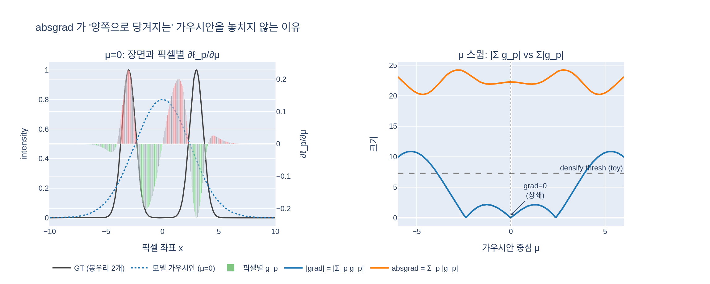
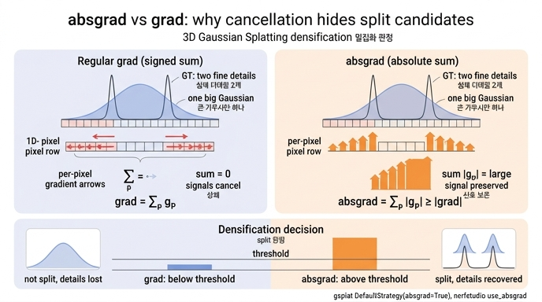

# absgrad가 일반 grad보다 densification 판단에 유리한 이유

## 한 줄 답

가우시안 하나의 화면 좌표 $\mu_i^{2D}$는 여러 픽셀에 기여하므로 일반 grad는 픽셀별 기여의 **부호 있는 합**이다. 서로 반대 방향으로 당기는 기여가 상쇄되면 "양쪽으로 당겨지는"(= 너무 뭉뚱그려 덮고 있어 쪼개야 할) 가우시안이 0 근처의 grad를 받아 densification 임계값을 넘지 못한다. absgrad는 픽셀별 기여의 **절댓값 합**이라 그 신호를 보존하며, 삼각부등식에 의해 항상 $\ge |\text{grad}|$다.

$$
\frac{\partial \mathcal L}{\partial \mu_i^{2D}} = \sum_{p} \frac{\partial \mathcal L}{\partial \mu_i^{2D}}\Big|_{p},
\qquad
\text{absgrad}_i = \sum_{p} \left|\frac{\partial \mathcal L}{\partial \mu_i^{2D}}\Big|_{p}\right|
\;\ge\; \left|\frac{\partial \mathcal L}{\partial \mu_i^{2D}}\right|
$$

## 왜 상쇄가 일어나는가

래스터화에서 가우시안 $i$는 자신이 덮는 모든 픽셀 $p$의 색에 기여하고, 픽셀별 손실 $\ell_p$는 각각 $\mu_i^{2D}$에 대해 "이 픽셀을 더 잘 맞추려면 중심을 어느 쪽으로 옮겨야 하는가"라는 방향 벡터를 낸다. 일반 backward는 이 벡터들을 그대로 더한다(autograd 규칙).

- **한쪽으로 치우친 경우**: 모든 픽셀이 같은 방향으로 밀면 합이 크다 → grad로도 잘 잡힌다.
- **큰 가우시안이 여러 구조를 한 번에 덮는 경우**: 왼쪽 디테일은 중심을 왼쪽으로, 오른쪽 디테일은 오른쪽으로 당긴다. 크기가 비슷하면 합이 ~0이 된다. 이 가우시안은 위치 최적화 관점에서는 "정류점"에 있지만, 표현 관점에서는 명백히 부족하다(두 개로 나눠야 한다).

즉 일반 grad는 **파라미터 업데이트에는 정확한 양**이지만, densification이 원하는 신호 — "이 가우시안이 덮은 영역에 아직 안 맞은 에러가 얼마나 있는가" — 를 재는 데는 부적절하다. 절댓값 합은 부호 정보를 버리는 대신 "에러 압력의 총량"을 재므로 이 목적에 맞는다. 이 관찰이 AbsGS(Ye et al. 2024, *AbsGS: Recovering Fine Details for 3D Gaussian Splatting*)의 핵심으로, 저자들은 원 3DGS가 큰 가우시안이 과도하게 덮인(over-reconstruction) 영역을 그래디언트 상쇄 때문에 놓쳐 미세 디테일이 뭉개진다고 지적하고, homodirectional(절댓값) view-space gradient로 대체해 이를 회복했다.

## 코드에서의 위치 (splatfacto / gsplat)

에셋 `splatfacto_train_step.py`의 D6·F·I 단계가 이 흐름을 그대로 보여준다.

1. **D5 래스터화** — `rasterization(..., absgrad=model.strategy.absgrad, ...)`. nerfstudio 설정 `use_absgrad=True`(기본)가 `DefaultStrategy(absgrad=True)`로 넘어가고, 이 플래그가 gsplat 커널에 전달된다.
2. **D6 `step_pre_backward`** — `info["means2d"].retain_grad()`. 중간 텐서인 화면 좌표에 그래디언트가 남도록 해 둔다.
3. **F backward** — `loss.backward()` 뒤 두 종류의 양이 생긴다.
   - 6개 파라미터의 `.grad`: 부호 합. G단계에서 Adam이 사용.
   - `info["means2d"].absgrad`: gsplat 래스터라이저 backward 커널이 픽셀(타일) 단위 기여를 절댓값으로 별도 누적한 텐서 `[1, N, 2]`. 파라미터 업데이트에는 쓰이지 않는다.
4. **I `step_post_backward` → `_update_state`** — absgrad는 NDC 단위이므로 $(W/2, H/2)$를 곱해 픽셀 단위로 바꾼 뒤 norm을 취해, 이번 스텝에 보인($r_i>0$) 가우시안만 `grad2d[i] += ...`, `count[i] += 1`로 누적한다.
5. **100스텝마다 `_grow_gs`** — $\bar g_i = \text{grad2d}_i/\text{count}_i > \tau_g$ (`densify_grad_thresh`=0.0008) 인 가우시안을, 크기가 $\tau_s$=0.01 미만이면 복제(clone), 이상이면 분할(split)한다. 여기서 비교되는 $\bar g_i$가 absgrad 기반이라 "양쪽으로 당겨지는 큰 가우시안"이 split 후보로 살아남는다.

`use_absgrad=False`로 두면 gsplat은 `means2d.grad`(부호 합)를 대신 사용하며, 원 3DGS와 동일한 동작이 된다. 임계값은 두 경우 다르게 튜닝돼야 함에 주의 — absgrad는 항상 더 크므로 같은 $\tau_g$면 더 많이 쪼개진다(AbsGS 논문에서도 임계값을 원 3DGS의 0.0002보다 높은 0.0008로 올렸고, splatfacto 기본값 0.0008도 그 계열이다).

## 정리 표

| | 일반 grad `means2d.grad` | absgrad `means2d.absgrad` |
|---|---|---|
| 정의 | $\sum_p \partial\mathcal L/\partial\mu\|_p$ | $\sum_p \|\partial\mathcal L/\partial\mu\|_p\|$ |
| 의미 | 손실을 줄이는 이동 방향·크기 | 가우시안이 받는 에러 압력의 총량 |
| 상쇄 | 반대 방향 기여가 서로 지움 | 지워지지 않음 |
| 크기 관계 | — | 항상 $\ge$ \|grad\| |
| 쓰이는 곳 | Adam 파라미터 업데이트 | densification 통계 `grad2d` |
| 놓치는 경우 | 대칭적으로 덮은 큰 가우시안(over-reconstruction) | — |

## 시각화

1D 토이(`expy.py`): 넓은 가우시안 하나가 떨어진 GT 봉우리 두 개를 덮을 때, $\mu=0$에서 픽셀별 그래디언트의 양·음 기여가 정확히 상쇄되어 grad = 0, absgrad ≈ 22. $\mu$를 스윕하면 $|\text{grad}|$는 대칭점 부근에서 임계값 아래로 떨어지지만 absgrad는 전 구간에서 임계값 위에 머문다.

## 인포그래픽

