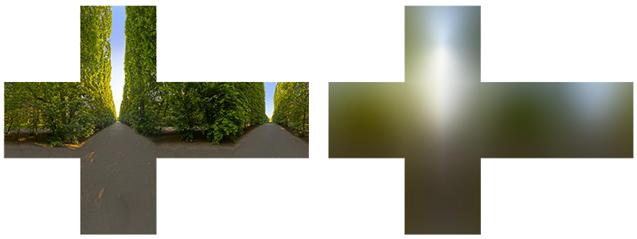

# Diffuse 반사에서 렌더링 방정식을 단순화하는 두 가지 근거

## 질문
Diffuse 반사에서 렌더링 방정식을 단순화할 수 있는 두 가지 근거는 무엇인가?

## 답
1. **Lambert BRDF는 상수** — Diffuse 반사에 주로 쓰이는 Lambert BRDF $f_r = \sigma/\pi$ 는 입사·출사 방향($\omega_i, \omega_o$)에 의존하지 않는 상수이므로 적분 밖으로 빼낼 수 있다.
2. **자체 방출광 없음** — 반사 표면이 스스로 빛을 내지 않는다고 가정하면 방출항 $L_e(\mathbf{x}, \omega_o)$ 를 0으로 놓고 제거할 수 있다.

---

## 1. 원래의 렌더링 방정식

$$
L_r(\mathbf{x},\omega_o) = L_e(\mathbf{x},\omega_o) + \int_{\Omega} f_r(\mathbf{x},\omega_i,\omega_o)\, L_i(\mathbf{x},\omega_i)\,(\omega_i\cdot\mathbf{n})\, d\omega_i
$$

| 기호 | 의미 |
|---|---|
| $L_r$ | 표면 $\mathbf{x}$에서 $\omega_o$ 방향으로 반사되어 나가는 radiance |
| $L_e$ | 표면 자체가 방출(emit)하는 radiance |
| $\Omega$ | 법선 $\mathbf{n}$을 중심으로 한 반구 공간 |
| $f_r$ | BRDF — 입사 방향 $\omega_i$의 빛이 $\omega_o$로 얼마나 반사되는지 |
| $L_i$ | $\omega_i$ 방향에서 들어오는 radiance |
| $\omega_i\cdot\mathbf{n}$ | 코사인 항 (입사각이 기울수록 단위 면적당 받는 빛이 줄어듦) |

이 식은 일반적으로 BRDF가 두 방향에 모두 의존하기 때문에 출사 방향 $\omega_o$마다 적분을 따로 해야 하고, 그대로는 사전 계산(precompute)이 어렵다.

## 2. 근거 ①: Lambert BRDF는 상수

Diffuse(난반사) 표면은 어느 방향에서 봐도 같은 밝기로 보인다는 것이 Lambert 모델의 가정이다. 이때 BRDF는

$$
f_r(\mathbf{x},\omega_i,\omega_o) = \frac{\sigma}{\pi}
$$

로, $\sigma$는 알베도(표면 반사율)이고 $\pi$는 반구 전체에 대해 에너지 보존($\int_\Omega \cos\theta\, d\omega = \pi$)을 맞추기 위한 정규화 상수다. 방향 변수가 전혀 없으므로 적분 변수 $\omega_i$에 대해 상수이고, **적분 기호 밖으로 빼낼 수 있다**. 그 결과 적분 안에는 $L_i(\omega_i)(\omega_i\cdot\mathbf{n})$만 남고, 이 적분은 $\omega_o$에 의존하지 않게 된다 — 즉 **법선 $\mathbf{n}$만의 함수**가 된다.

## 3. 근거 ②: 방출광 $L_e = 0$

IBL(Image Based Lighting)로 조명을 받는 일반적인 물체 표면은 스스로 빛을 내지 않으므로 $L_e(\mathbf{x},\omega_o)=0$ 으로 둘 수 있다. (발광 재질이 필요하면 렌더링 시 별도의 emissive 항으로 더해 주면 된다.)

## 4. 단순화된 결과

두 근거를 적용하면

$$
L_r(\mathbf{x},\omega_o) = \frac{\sigma}{\pi}\int_{\Omega} L_i(\mathbf{x},\omega_i)\,(\omega_i\cdot\mathbf{n})\, d\omega_i
$$

그리고 Lambert BRDF를 떼어내면 남는 적분이 바로 **Irradiance**다.

$$
E(\mathbf{x}) = \int_{\Omega} L_i(\mathbf{x},\omega_i)\,(\omega_i\cdot\mathbf{n})\, d\omega_i
$$

## 5. 왜 중요한가 — Irradiance Map 사전 계산

단순화 덕분에 적분은 법선 방향 $\mathbf{n}$에만 의존하므로, 모든 $\mathbf{n}$에 대해 $E(\mathbf{n})$을 **미리 계산해 큐브맵에 저장**해 둘 수 있다. 이것이 Irradiance Map이다. 렌더링 시에는 법선으로 큐브맵을 한 번 샘플링하고 $\sigma/\pi$ (알베도)를 곱하면 diffuse 조명이 끝난다.

그림에서 왼쪽은 원본 HDR 환경 큐브맵(나무가 늘어선 길), 오른쪽은 같은 환경에 대해 위 적분을 수행한 Irradiance Map이다. 오른쪽이 극단적으로 흐릿한 이유가 바로 이 단순화의 결과다. 각 픽셀(= 법선 방향 하나)은 반구 전체의 입사광을 코사인 가중으로 적분한 값이므로 고주파 디테일이 모두 평균되어 사라지고, 위쪽(하늘)이 밝고 아래쪽(땅)이 어두운 저주파 성분만 남는다. 원문은 이 저주파 특성 때문에 32x32 정도의 작은 큐브맵으로도 충분하고, 더 나아가 구면 조화 함수(Spherical Harmonics) 몇 개의 계수만으로 표현할 수 있다고 이어 간다.

## 6. 한 줄 정리

- BRDF가 상수(Lambert) → 적분 밖으로 → 적분이 $\mathbf{n}$만의 함수가 됨 → 사전 계산 가능
- $L_e=0$ → 방출항 제거 → 순수 반사 적분(Irradiance)만 남음

## 참고
- 원문: `spherical-harmonics.md` "Irradiance Map" 절
- LearnOpenGL, [Diffuse irradiance](https://learnopengl.com/PBR/IBL/Diffuse-irradiance)
