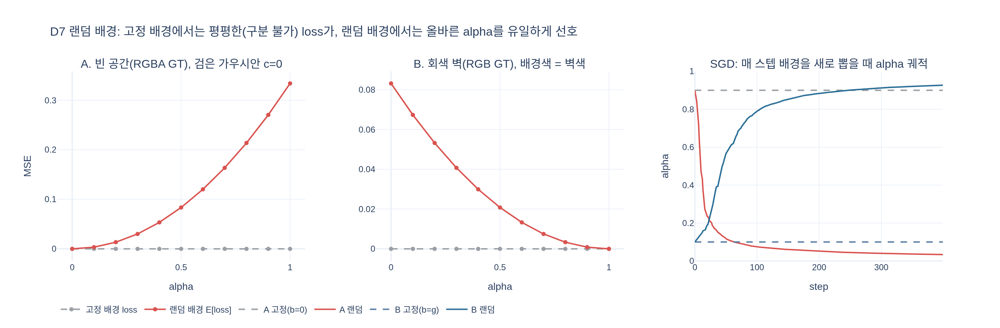

# D7 배경 합성 공식과 랜덤 배경을 쓰는 이유

## 질문
D7 배경 합성 공식과 랜덤 배경을 쓰는 이유는?

## 답
$$
\text{rgb}(p) = \operatorname{clamp}\big(\text{render}(p) + (1-\text{alpha}(p))\,b,\ 0,\ 1\big),\qquad b \sim U[0,1]^3
$$

매 스텝 배경색 $b$가 바뀌어, 가우시안이 배경색을 흉내내며 빈 공간을 덮는 것을 억제한다.

---

## 1. D7이 파이프라인에서 어디에 있나

splatfacto의 `get_outputs(camera)`(D 단계)는 다음 순서로 진행됩니다.

```
D1 카메라 보정 → D2 해상도 스케줄 → D3 viewmat/K → D4 SH 색 → D5 gsplat rasterization
→ D6 alpha 정리 → D7 배경 합성
```

D5의 `rasterization()`은 두 가지를 돌려줍니다.

- `render[..., :3]` — **premultiplied** 색. 픽셀 $p$를 지나는 가우시안 $i$들의 알파 블렌딩 결과
  $\sum_i c_i\,\alpha_i \prod_{j<i}(1-\alpha_j)$
- `alpha` — 누적 불투명도 $\text{alpha}(p) = 1-\prod_i(1-\alpha_i)$

`render`에는 배경이 들어 있지 않습니다. 가우시안이 충분히 덮지 못한 잔여 투과율 $1-\text{alpha}(p)$ 만큼을 D7에서 배경색 $b$로 채우는 것이 배경 합성입니다. 실제 코드(`nerfstudio/models/splatfacto.py`):

```python
background = self._get_background_color()
rgb = render[:, ..., :3] + (1 - alpha) * background
rgb = torch.clamp(rgb, 0.0, 1.0)
```

`clamp`는 SH 색이 $[0,1]$ 밖으로 튈 수 있기 때문에 최종 안전장치로 붙어 있습니다.

## 2. 배경색 $b$는 어떻게 정해지나 — `_get_background_color()`

```python
def _get_background_color(self):
    if self.config.background_color == "random":
        if self.training:
            background = torch.rand(3, device=self.device)   # 매 스텝 U[0,1]^3
        else:
            background = self.background_color.to(self.device)  # 고정색 (Viser 기본 배경)
    elif self.config.background_color == "white":
        background = torch.ones(3, device=self.device)
    elif self.config.background_color == "black":
        background = torch.zeros(3, device=self.device)
```

- `background_color: Literal["random", "black", "white"] = "random"` 이 기본값입니다.
- `"random"`이라도 **학습 중에만** 랜덤이고, 평가/뷰어 렌더 시에는 `[0.1490, 0.1647, 0.2157]`(Viser 기본 배경색)로 고정됩니다. 즉 랜덤성은 순수하게 **학습 정규화 장치**입니다.
- `torch.rand(3)` 는 픽셀별이 아니라 **이미지 전체에 한 색**입니다. 스텝마다 다른 단색 배경이 깔립니다.

## 3. GT 쪽도 같은 배경으로 맞춘다 — `composite_with_background()`

loss를 계산할 때 GT 이미지에도 같은 `outputs["background"]`를 넘겨 합성합니다.

```python
def composite_with_background(self, image, background):
    if image.shape[2] == 4:                     # RGBA GT (마스크/알파 있는 데이터셋)
        alpha = image[..., -1].unsqueeze(-1).repeat((1, 1, 3))
        return alpha * image[..., :3] + (1 - alpha) * background
    else:                                       # RGB 사진 → no-op
        return image
```

- GT가 **RGBA**(예: NeRF-synthetic처럼 물체만 있고 배경이 투명한 데이터)면, 진짜로 비어 있는 곳의 GT는 그 스텝의 $b$가 됩니다. 모델이 그 픽셀을 `alpha=0`으로 두면 pred도 $b$ → 어떤 $b$가 와도 일치합니다.
- GT가 **RGB 사진**이면 no-op입니다. 실제 야외/실내 캡처는 대부분 이 경로이며, 화면 어디에도 "빈 공간"이 없으므로 모델은 모든 픽셀을 `alpha→1`로 덮어야만 $b$의 영향을 지울 수 있습니다.

## 4. 왜 랜덤인가 — "alpha를 식별 가능하게 만든다"

핵심은 $(1-\text{alpha})\,b$ 항입니다. 배경이 고정이면 이 항은 상수에 가까워져 다음 두 가지가 loss 상 **완전히 동일**해집니다.

| 상황 | 해 ① | 해 ② | 고정 배경에서 |
|---|---|---|---|
| A. 빈 공간(RGBA GT, 검은 배경) | `alpha=0` (진짜 비움) | `alpha=1, c=검정` (검은 가우시안으로 덮음) | 둘 다 loss 0 |
| B. 배경색과 같은 색의 벽(RGB GT) | `alpha=1, c=벽색` (제대로 덮음) | `alpha=0` (배경에 기대어 구멍) | 둘 다 loss 0 |

해 ②들은 이미지 loss는 만족하지만 지오메트리가 틀린 해입니다. A-②는 빈 공간에 불필요한 "배경색 가우시안"이 생겨 다른 시점에서 floater로 보이고 가우시안 수만 늘립니다. B-②는 실제 표면에 구멍이 생겨 다른 배경으로 렌더하거나 depth를 뽑으면 뚫려 보입니다.

배경을 $b\sim U[0,1]^3$로 매 스텝 바꾸면(픽셀 하나에 가우시안 하나인 토이 기준):

- **A**: pred $=(1-a)b$, GT $=b$ → $\mathbb{E}_b\|{\cdot}\|^2 = a^2\,\mathbb{E}[b^2] = a^2/3$ (채널당). $a=0$이 유일한 최소. 검은 가우시안으로 덮으면 배경이 흰색인 스텝에서 크게 틀리므로 "배경색 흉내"가 들통납니다.
- **B**: pred $=(1-a)b + a g$, GT $=g$ → $(1-a)^2\,\mathbb{E}[(b-g)^2]$. $a=1$이 유일한 최소. 내용이 있는 곳은 반드시 가우시안으로 덮게 강제됩니다.

즉 랜덤 배경은 "배경이 어떤 색이든 결과가 같으려면 alpha가 정확해야 한다"는 제약을 loss에 심는 장치입니다. 이는 원조 3DGS 구현이 흰/검 고정 배경을 쓰는 것과 다른, nerfstudio(및 NeRF 계열 `randomized background` 관행)의 선택입니다.

### 고정 white/black 옵션은 언제 쓰나
- 데이터셋 배경이 정말로 흰색/검정으로 알려져 있고 RGBA 마스크가 있을 때(합성 데이터), 평가 프로토콜을 맞추기 위해.
- 다만 위 표의 문제(배경색 가우시안, 구멍)를 loss가 잡아주지 못하므로 기본값은 `"random"`입니다.

## 5. 수치 검증 요약 (expy.py)

`expy.py`의 1D 토이에서:
- 고정 배경: 케이스 A, B 모두 alpha가 0~1 어디에 있어도 loss = 0 (평평함).
- 랜덤 배경(몬테카를로 2만 샘플): 케이스 A는 $a^2/3$, 케이스 B는 $(1-a)^2\mathbb{E}[(b-g)^2]$ 이론값과 소수 3자리까지 일치.
- 매 스텝 $b$를 새로 뽑는 SGD: A는 $a_0=0.9\to0.03$, B는 $a_0=0.1\to0.93$ 으로 수렴. 고정 배경에서는 기울기가 0이라 초기값 그대로 남음.

## 참고
- `analysis/.fm/assets/splatfacto_train_step.py` D7 절 및 E(loss) 절
- `nerfstudio/models/splatfacto.py`: `SplatfactoModelConfig.background_color`, `_get_background_color`, `get_outputs`, `composite_with_background`

## 시각화

