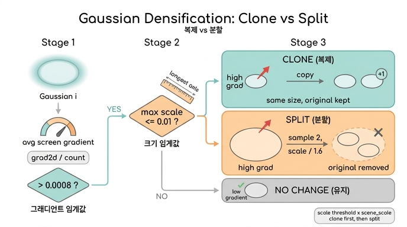

# `_grow_gs`에서 복제(clone)와 분할(split)은 어떻게 갈리는가?

**한 줄 답.** 먼저 "평균 화면공간 그래디언트가 큰가"로 후보를 고르고($\bar g_i > \tau_g$), 그 후보를 "3D 크기가 작은가/큰가"로 나눈다. 작으면 **복제**(같은 파라미터를 하나 더), 크면 **분할**(원본을 지우고 작은 2개로).

$$
\bar g_i = \frac{\text{grad2d}_i}{\text{count}_i} > \tau_g
\;\Longrightarrow\;
\begin{cases}
\max_k \exp(\tilde s_{ik}) \le \tau_s & \text{clone} \\
\max_k \exp(\tilde s_{ik}) > \tau_s & \text{split}
\end{cases}
\qquad \tau_g = 0.0008,\ \tau_s = 0.01
$$

---

## 1. 판정 재료: `grad2d / count`

`step_post_backward` → `_update_state`가 매 스텝 누적하는 두 통계가 판정 재료다.

- `grad2d[i] += ‖absgrad_i ⊙ (W/2, H/2)‖₂` — `means2d`의 절대값 그래디언트(splatfacto는 `use_absgrad=True`)를 NDC에서 픽셀 단위로 바꿔 누적.
- `count[i] += 1` — 이번 스텝에 화면에 보인($r_i>0$) 가우시안만.

`_grow_gs` 첫 줄에서 `grads = grad2d / count.clamp_min(1)`로 "보였을 때의 평균 그래디언트" $\bar g_i$를 만든다. 이 값이 크다는 것은 그 가우시안이 위치를 계속 크게 흔들어야 할 만큼 재구성이 덜 된 영역을 덮고 있다는 신호다. refine 때마다(`refine_every`=100 스텝) `grad2d`, `count`는 0으로 리셋되므로 최근 100스텝의 평균이다.

## 2. 두 마스크: `is_grad_high`와 `is_small`

gsplat `DefaultStrategy._grow_gs` (strategy/default.py):

```python
is_grad_high = grads > self.grow_grad2d                       # τ_g
is_small = torch.exp(params["scales"]).max(dim=-1).values \
           <= self.grow_scale3d * state["scene_scale"]        # τ_s · scene_scale
is_dupli = is_grad_high & is_small
is_large = ~is_small
is_split = is_grad_high & is_large
if step < self.refine_scale2d_stop_iter:
    is_split |= state["radii"] > self.grow_scale2d           # 화면공간 크기 규칙(기본 꺼짐)
```

- **크기 기준**은 3축 스케일 중 **가장 큰 축** $\max_k \exp(\tilde s_{ik})$. 스케일은 로그 파라미터라 `exp`로 되돌려 비교한다.
- 경계값 $=\tau_s$는 `<=`로 **clone** 쪽에 속한다(답변의 "<"/"≥"는 개념적 요약이며 코드는 `<=`/`>`).
- `grow_scale3d`에 **`state["scene_scale"]`을 곱한다.** splatfacto는 `initialize_state(scene_scale=1.0)`으로 넣어서 사실상 $\tau_s = 0.01$ 그대로 월드 단위다. (gsplat 예제처럼 scene_scale을 카메라 분포 반경으로 넣으면 "씬 크기의 1%"라는 상대 기준이 된다.)
- `is_dupli`와 `is_split`은 `is_small`/`is_large`가 서로 여집합이라 **배타적**이다 — 하나의 가우시안은 둘 중 하나만 겪는다.

### nerfstudio 설정과의 대응

| gsplat 인자 | splatfacto config | 값 |
|---|---|---|
| `grow_grad2d` | `densify_grad_thresh` | 0.0008 |
| `grow_scale3d` | `densify_size_thresh` | 0.01 |
| `grow_scale2d` | `split_screen_size` | 0.05 |
| `refine_scale2d_stop_iter` | `stop_screen_size_at` | 4000 |
| `revised_opacity` | (고정) | False |

`refine_scale2d_stop_iter`가 0보다 크면 `state["radii"]`(정규화된 화면공간 반경의 최대치)를 추적하고, 그 스텝 전까지는 **그래디언트가 낮아도** 화면에서 너무 크게 보이는 가우시안(반경 > 5% 화면)을 강제로 split 대상에 추가한다. 원 3DGS 구현의 "big points in view space" 규칙에 해당한다.

## 3. 복제 vs 분할이 실제로 하는 일 (strategy/ops.py)

### `duplicate` — 같은 것을 하나 더
```python
param_fn = lambda name, p: Parameter(torch.cat([p, p[sel]]))
```
모든 파라미터(means, scales, quats, opacities, features)를 그대로 복사해 **뒤에 붙인다**. 원본은 남고, 총 개수는 $+n_\text{dupli}$. 이후 두 복사본이 서로 다른 그래디언트를 받으며 갈라지길 기대한다. 옵티마이저 모멘트(`exp_avg`, `exp_avg_sq`)는 새 항목에 0으로 채운다.

### `split` — 원본을 지우고 작은 2개로
```python
samples = einsum(R(q), s, randn(2, N, 3))          # 원본 공분산에서 2개 샘플
means'   = mean + samples                          # 두 위치
scales'  = log(s / 1.6)                            # 1.6배 축소 (3DGS 논문의 φ=1.6)
opac'    = revised_opacity ? logit(1 - sqrt(1 - α)) : 그대로
p_new    = cat([p[rest], p_split])                 # rest = ~mask → 원본 제거
```
- 새 위치 $\mu' = \mu + R(q)(s \odot z)$, $z\sim\mathcal N(0,I)$: 원본 가우시안의 형태(회전·스케일)를 따르는 분포에서 2점을 뽑는다.
- 스케일은 $s/1.6$으로 줄인다.
- **`p[rest]`만 남기므로 원본은 삭제**된다. 총 개수는 $+n_\text{split}$ (2개 추가, 1개 제거).
- `revised_opacity=True`(arXiv:2404.06109)면 두 조각이 겹쳐 합쳐질 때 원본과 같은 불투명도가 되도록 $\alpha' = 1-\sqrt{1-\alpha}$로 낮춘다. splatfacto는 False로 고정해 불투명도를 그대로 복사한다.

### 순서와 마스크 패딩
`_grow_gs`는 **복제를 먼저** 실행하고, 그 뒤 `is_split`에 `zeros(n_dupli)`를 이어붙여 길이를 맞춘다 — 방금 복제로 생긴 가우시안은 이번 라운드에서 split되지 않도록 하는 장치다. 이후 `_prune_gs`, 통계 리셋이 따른다.

## 4. 왜 크기로 갈리는가 (3DGS 논문 Sec. 5.2의 직관)

| 상황 | 해석 | 처리 |
|---|---|---|
| 높은 $\bar g$, **작은** 가우시안 | 그 영역을 덮을 **표현력(개수)이 모자람**(under-reconstruction) | clone: 같은 크기로 하나 더 두어 채움 |
| 높은 $\bar g$, **큰** 가우시안 | 하나가 **너무 뭉뚱그려** 덮음(over-reconstruction) | split: 쪼개서 세부를 표현 |
| 낮은 $\bar g$ | 이미 잘 맞음 | 그대로 (prune 규칙만 적용) |

두 경우 모두 "위치 그래디언트가 크다"는 같은 증상이지만 원인이 다르고, 그 원인을 **크기**로 구분한다는 것이 핵심이다. 복제는 볼륨을 늘리고, 분할은 총 볼륨을 대체로 유지하면서 해상도만 높인다.

## 5. 기억 포인트

1. 1차 필터 = 그래디언트($\bar g_i>\tau_g$), 2차 분기 = 최대 축 스케일($\le \tau_s$ clone / $> \tau_s$ split).
2. $\tau_s$에는 `scene_scale`이 곱해진다(splatfacto는 1.0).
3. clone은 원본 유지(+1), split은 원본 삭제 후 $s/1.6$인 2개(+1 순증).
4. 복제 먼저, split 마스크는 0으로 패딩 → 새 복제본은 같은 라운드에 split 안 됨.
5. `refine_scale2d_stop_iter` 이전에는 화면공간 반경 규칙이 split을 추가로 강제할 수 있다(nerfstudio 기본 4000).

## 인포그래픽


