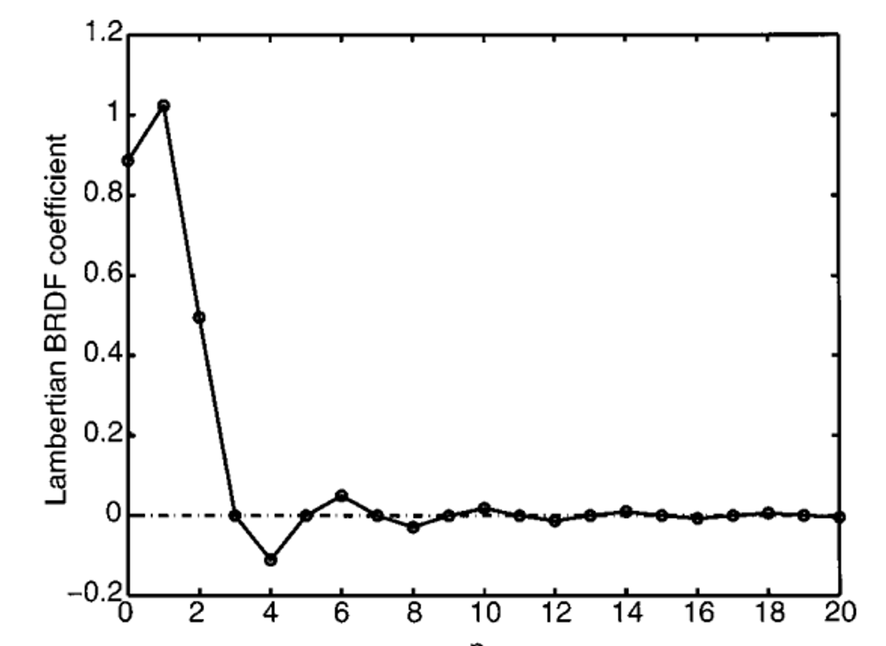
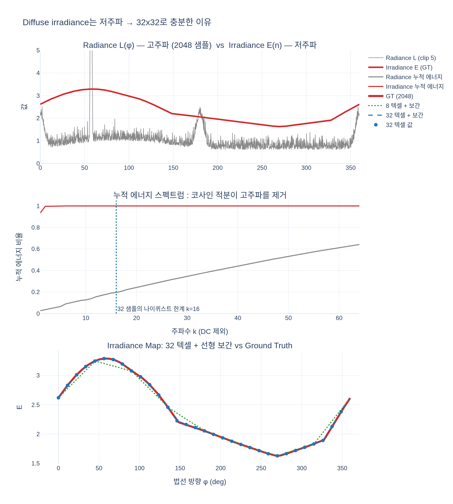

# 원본 큐브맵이 2048x2048인데도 Irradiance Map을 32x32로 만들어도 괜찮은 이유는?

> **답**: Diffuse 반사는 주파수가 낮아 세밀한 디테일이 필요 없기 때문이다. 또한 텍스쳐 보간이 적용되므로 작은 큐브맵으로도 시각적 품질이 유지된다.

## 1. Irradiance Map이 담는 것은 "radiance"가 아니라 "적분값"이다

원본 큐브맵(스카이박스)은 각 방향에서 들어오는 빛 **radiance** $L_i(\omega)$를 저장한다. 구름의 가장자리, 작은 태양, 수면의 반짝임처럼 방향에 따라 급격히 바뀌는 고주파 디테일이 가득하므로 2048x2048 같은 고해상도가 필요하다.

반면 Irradiance Map은 법선 $\mathbf n$마다 **반구 전체에 걸친 코사인 가중 적분**을 저장한다.

$$E(\mathbf n)=\int_{\Omega(\mathbf n)} L_i(\omega)\,(\omega\cdot\mathbf n)\,d\omega$$

(Lambert BRDF $\sigma/\pi$는 상수라 적분 밖으로 나가므로, 셰이더에서는 $E(\mathbf n)$만 저장하고 알베도는 나중에 곱한다.)

적분이란 곧 넓은 커널(클램프 코사인 로브, 반구 전체)과의 컨볼루션이다. 이는 **저역 통과 필터**이므로, 입력에 아무리 고주파 디테일이 많아도 출력 $E(\mathbf n)$은 법선 방향에 따라 아주 천천히 변하는 부드러운 함수가 된다.

| 원본 스카이박스 (2048x2048 radiance) | Irradiance Map (32x32) |
| --- | --- |
|  |  |

왼쪽 원본에는 구름 조각, 수평선의 밝은 띠, 우상단 면의 작은 태양 하이라이트 등 세밀한 구조가 보인다. 오른쪽 Irradiance Map에서는 이들이 모두 사라지고, 위쪽 면은 어두운 파랑(하늘 방향 법선이 받는 빛), 옆면은 수평선 밝기가 섞인 중간 톤, 아래쪽 면은 바다의 진한 파랑으로 **면 단위의 완만한 그라데이션**만 남는다. 32x32 텍셀만으로도 이 정도의 부드러운 변화를 표현하는 데 아무 문제가 없다는 것을 그림 자체가 보여준다.

## 2. 수학적 근거: 클램프 코사인 커널의 SH 계수 $\hat A_l$

Ramamoorthi & Hanrahan(2001)은 클램프 코사인 $\max(0,\cos\theta)$를 구면 조화 함수로 전개하면 계수 $\hat A_l$이 다음처럼 급격히 감소함을 보였다.

$$\hat A_0=3.1415,\quad \hat A_1=2.0943,\quad \hat A_2=0.7853,\quad \hat A_3=0,\quad \hat A_4=-0.1309,\quad \hat A_5=0,\quad \hat A_6=0.0490$$



그래프에서 $l=0,1$에서 큰 값을 가진 뒤 $l=2$에서 절반 이하로 떨어지고, $l\ge3$부터는 0 근처에서 미세하게 진동만 한다. 컨볼루션 정리에 따라 Irradiance의 SH 계수는 $E_{lm}=\hat A_l\,L_{lm}$이므로, radiance $L_{lm}$이 고차 항에 아무리 큰 에너지를 갖고 있어도 $\hat A_l\approx0$에 곱해져 사라진다. 실제로 $l\le2$ (9개 계수)만으로 전체 irradiance 에너지의 99% 이상이 표현된다.

이것이 "Diffuse 반사는 주파수가 낮다"는 말의 정확한 의미다. **신호에 고주파 성분이 없으면, 나이퀴스트 관점에서 적은 샘플로 손실 없이 표현할 수 있다.** 큐브맵 한 면이 32x32이면 대략 $l\approx 16$ 수준의 대역까지 표현 가능하며, 이는 $l\le2$가 지배적인 irradiance에게 과분할 정도의 해상도다.

## 3. 텍스쳐 보간이 나머지를 채운다

셰이더는 Irradiance Map을 `LinearSampler`로 읽는다.

```hlsl
float3 ImageBasedLight( float3 normal )
{
    return IrradianceMap.Sample( LinearSampler, normal ).rgb;
}
```

텍셀 32개 사이의 값은 하드웨어가 바이리니어 보간으로 채워준다. 원래 신호가 부드러우므로 텍셀 사이를 직선으로 이어도 실제 값과 거의 일치한다. 텍셀 경계에서 계단이 보이는 현상(블록 아티팩트)은 신호에 텍셀 간격보다 빠른 변화가 있을 때만 생기는데, irradiance에는 그런 변화가 없다.

즉 두 요인이 결합된다.
1. **저주파 신호** → 샘플 32개로 표현할 정보가 이미 충분하다.
2. **선형 보간** → 샘플 사이의 값을 부드럽게 재구성하므로, 결과가 원본 해상도로 계산한 것과 시각적으로 구별되지 않는다.

## 4. 왜 굳이 작게 만드는가: 비용

Irradiance Map 생성 셰이더는 텍셀마다 반구 전체를 `SampleDelta` 간격으로 이중 루프로 순회한다. 텍셀 수가 2048x2048x6이면 이 비용이 32x32x6 대비 4096배가 되므로, 필요 없는 해상도를 쓰는 것은 순수한 낭비다. 메모리 역시 32x32x6x4Byte = 약 24KB로 끝난다. 원문은 여기서 한 걸음 더 나아가, 같은 저주파 성질을 이용하면 SH 9계수 x RGB = 108Byte만으로도 거의 같은 결과를 얻는다고 이어간다.

## 5. 주의: 이것은 Diffuse에만 해당

Specular(거울 반사)는 BRDF 로브가 좁아서 radiance의 고주파 성분이 그대로 결과에 남는다. 그래서 Pre-filtered Specular Map은 roughness별 mip 체인을 두고 낮은 roughness에서는 큰 해상도를 유지해야 한다. "작은 해상도로 충분하다"는 결론은 커널이 반구 전체를 덮는 Lambert diffuse의 특수한 성질에서 나온 것이다.

## 시각화

`expy.py`는 개념을 1D 원 위의 환경으로 축소해 확인한다. 위: 2048 샘플의 고주파 radiance(회색, 태양 스파이크와 구름 잡음 포함)와 그로부터 계산한 irradiance(빨강)가 얼마나 부드러운지. 가운데: 누적 에너지 스펙트럼 — irradiance는 $k\le3$에서 거의 100%에 도달하는 반면 radiance는 고주파에 대부분의 에너지가 있다. 아래: 텍셀 32개(파란 점) + 선형 보간이 GT(빨강)와 겹쳐 구분되지 않으며(최대 오차 0.8%), 텍셀 8개(초록 점선)조차 대체로 형태를 따라간다. 반대로 radiance 자체를 32 샘플로 줄이면 최대 오차 600% 이상으로 태양이 사라진다.


