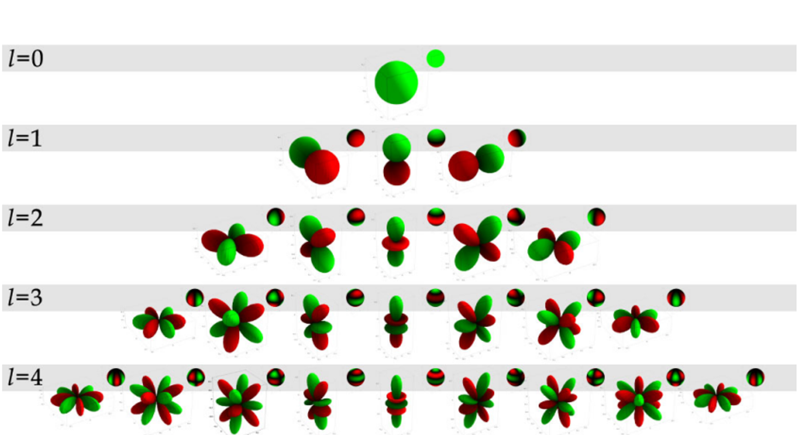

# 실수 구면 조화 함수 $y_l^m(\theta,\varphi)$의 정의

## 한 줄 요약

$$
y_{l}^{m}(\theta,\varphi)=
\begin{cases}
\sqrt{2}\,K_{l}^{m}\cos(m\varphi)\,P_{l}^{m}(\cos\theta), & m>0\\[4pt]
\sqrt{2}\,K_{l}^{m}\sin(-m\varphi)\,P_{l}^{-m}(\cos\theta), & m<0\\[4pt]
K_{l}^{0}\,P_{l}^{0}(\cos\theta), & m=0
\end{cases}
$$

- $P_l^m$ : 버금 르장드르 다항식(Associated Legendre Polynomial). $\theta$ 방향(위·아래, 극각)의 모양을 담당.
- $\cos(m\varphi)$, $\sin(-m\varphi)$ : $\varphi$ 방향(수평 회전, 방위각)의 모양을 담당.
- $K_l^m$ : 정규화 배율 계수. 함수를 구 전체에서 적분했을 때 크기가 1이 되도록 맞춰 준다.

$$
K_{l}^{m}=\sqrt{\frac{2l+1}{4\pi}\cdot\frac{(l-|m|)!}{(l+|m|)!}}
$$

## 왜 "실수" 버전인가

교과서·위키에서 흔히 보는 일반 구면 조화 함수는

$$Y_l^m(\theta,\phi)=A\,P_l^m(\cos\theta)\,e^{im\phi}$$

처럼 $e^{im\phi}$ 항 때문에 **복소수**를 돌려준다. 렌더링(Irradiance Map, 3DGS의 색 표현 등)에서는 실수 계수만 필요하므로, $e^{im\phi}=\cos(m\phi)+i\sin(m\phi)$의 실수부·허수부를 각각 따로 기저로 쓰는 것이 실수 구면 조화 함수다.

- $m>0$ 는 $\cos$ 쪽(실수부), $m<0$ 는 $\sin$ 쪽(허수부)을 맡는다.
- $\pm m$ 한 쌍이 원래 복소 함수 두 개( $Y_l^m$, $Y_l^{-m}$ )를 대신하므로, 크기를 보존하려고 $\sqrt{2}$ 가 붙는다. $m=0$ 은 원래부터 실수( $e^{0}=1$ )라 $\sqrt{2}$ 가 없다.
- $m<0$ 인 경우 $P$ 의 위 첨자는 $-m$(양수)인 점에 주의 — 버금 르장드르 다항식은 원문에서 $0\le m\le l$ 범위로만 정의했기 때문이다. $\sin(-m\varphi)$ 도 같은 이유로 인자를 양수로 만들어 둔 것이다.

## 인덱스 범위

| | $l$ (band index) | $m$ |
|---|---|---|
| 버금 르장드르 $P_l^m$ | $0,1,2,\dots$ | $0 \le m \le l$ |
| 구면 조화 $y_l^m$ | $0,1,2,\dots$ | $-l \le m \le l$ |

따라서 band $l$ 에는 $2l+1$ 개의 함수가 있고, $l=0\ldots L$ 까지 합치면 $(L+1)^2$ 개다.

$$
\begin{array}{c}
y_0^0\\
y_1^{-1}\ y_1^{0}\ y_1^{1}\\
y_2^{-2}\ y_2^{-1}\ y_2^{0}\ y_2^{1}\ y_2^{2}
\end{array}
$$



그림에서 확인할 수 있는 정의의 흔적:
- 각 행 $l$ 에 정확히 $2l+1$ 개( $1,3,5,7,9$ 개)의 함수가 있다 — $m$ 이 $-l\ldots l$ 이기 때문.
- 가운데 열( $m=0$ )은 $\varphi$ 에 무관해 세로축 대칭의 회전체 모양이다. $\cos(0\cdot\varphi)$ 항이 없고 $P_l^0(\cos\theta)$ 만 남기 때문.
- 가운데에서 바깥으로 갈수록( $|m|$ 증가) 수평 방향으로 잘린 조각(꽃잎)이 늘어난다 — $\cos(m\varphi)$, $\sin(m\varphi)$ 가 한 바퀴에 $2|m|$ 번 부호가 바뀌기 때문.
- 가운데 기준으로 좌우 대칭 위치( $\pm m$ )는 같은 모양을 수평으로 $90^\circ/|m|$ 만큼 돌린 것이다 — $\cos$ 과 $\sin$ 의 위상 차.
- 각 행에서 위·아래 방향으로 나뉘는 층 수는 $l-|m|$ 에 따라 정해진다 — $P_l^m(\cos\theta)$ 의 영점 개수가 $l-m$ 개이기 때문.
- 초록/붉은은 함수값의 양/음. $l=0$ 은 상수( $0.282095 = 1/\sqrt{4\pi}$ )라 전체가 초록 구다.

## 실제 구현에서의 사용

원문 코드(Green, *Spherical Harmonic Lighting: The Gritty Details*)는 정의를 그대로 옮긴 것이다.

```c
double K(int l, int m) {
    double temp = ((2.0*l+1.0) * factorial(l-m)) / (4.0*PI * factorial(l+m));
    return sqrt(temp);
}
double SH(int l, int m, double theta, double phi) {
    const double sqrt2 = sqrt(2.0);
    if (m == 0)     return K(l,0)  * P(l, m, cos(theta));
    else if (m > 0) return sqrt2 * K(l, m)  * cos(m*phi)  * P(l,  m, cos(theta));
    else            return sqrt2 * K(l,-m)  * sin(-m*phi) * P(l, -m, cos(theta));
}
```

실무에서는 $(x,y,z)=(\sin\theta\cos\phi,\ \sin\theta\sin\phi,\ \cos\theta)$ 로 바꿔 미리 전개해 둔 다항식 표를 쓴다( $l\le 2$ ):

$$
\begin{aligned}
y_0^0&=0.282095 \\
y_1^{-1}&=0.488603\,y,\quad y_1^{0}=0.488603\,z,\quad y_1^{1}=0.488603\,x\\
y_2^{-2}&=1.092548\,xy,\quad y_2^{-1}=1.092548\,yz,\quad y_2^{0}=0.315392\,(3z^2-1)\\
y_2^{1}&=1.092548\,xz,\quad y_2^{2}=0.546274\,(x^2-y^2)
\end{aligned}
$$

예: $y_1^1=\sqrt2 K_1^1\cos\varphi\,P_1^1(\cos\theta)$ 에서 $P_1^1(x)=-\sqrt{1-x^2}$ 이므로 $P_1^1(\cos\theta)=-\sin\theta$, $K_1^1=\sqrt{3/(8\pi)}$. 곱하면 $-\sqrt{3/(4\pi)}\sin\theta\cos\varphi=-0.488603\,x$ — 표와 부호만 다르다(Condon–Shortley 위상 $(-1)^m$ 을 표에서는 생략하는 관례). 부호 관례는 문헌마다 다르니 코드와 표를 섞어 쓸 때 주의.

## 기억 팁

"**$\sqrt2\,K\,\cdot$(각도 함수)$\,\cdot P$**" 구조에서
- $m$ 의 부호 → $\cos$ / $\sin$ 선택,
- $m=0$ → $\sqrt2$ 없음,
- $P$ 와 $K$ 는 항상 $|m|$ 으로 계산.
